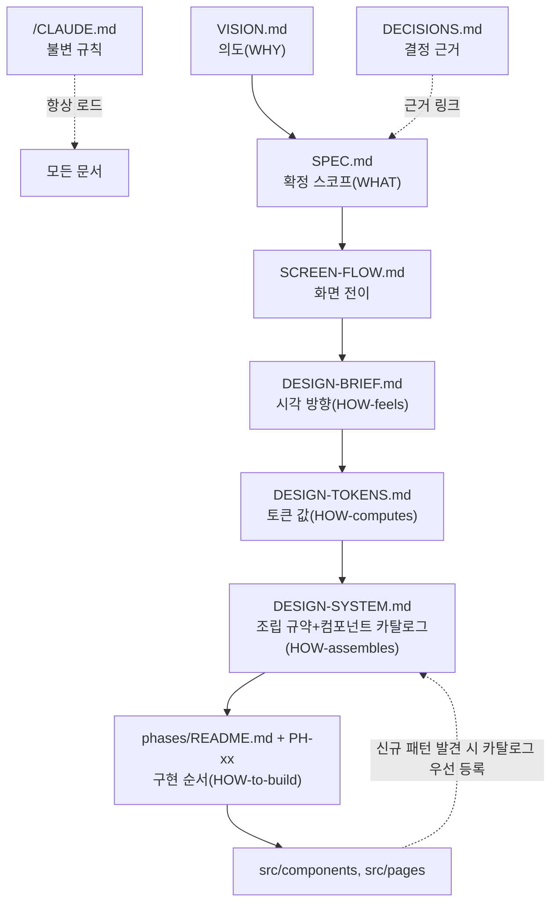

# 컴페이스 — 문서 지도

원본 보존은 `_archive/`

## 문서 역할 & 로드 시점

| 문서                                                                                    | 역할                                                                                                                                                                                                                                                                                                            | 언제 읽나                                                                                                                                                     | 분량               |
| --------------------------------------------------------------------------------------- | --------------------------------------------------------------------------------------------------------------------------------------------------------------------------------------------------------------------------------------------------------------------------------------------------------------- | ------------------------------------------------------------------------------------------------------------------------------------------------------------- | ------------------ |
| [`/CLAUDE.md`](../CLAUDE.md)                                                            | **가드레일 / 불변 규칙**                                                                                                                                                                                                                                                                                        | 항상(자동 로드)                                                                                                                                               | 최소               |
| [`VISION.md`](VISION.md)                                                                | **의도·방향(WHY)** — 북극성·페르소나·안티골                                                                                                                                                                                                                                                                     | 제품 의도를 판단할 때                                                                                                                                         | 짧음               |
| [`SPEC.md`](SPEC.md)                                                                    | **현재 확정 스코프(WHAT/NOW)** — MVP 규칙·화면·엣지                                                                                                                                                                                                                                                             | 구현·기능 결정 시                                                                                                                                             | 중간               |
| [`SCREEN-FLOW.md`](SCREEN-FLOW.md)                                                      | **화면 전이·상태 로직**                                                                                                                                                                                                                                                                                         | 화면/플로우 작업 시                                                                                                                                           | 중간               |
| [`DESIGN-BRIEF.md`](DESIGN-BRIEF.md)                                                    | **시각·인터랙션·톤 방향(HOW-it-feels)** — 스타일·팔레트·타이포·모션·톤/만트라·상태 시각 규약                                                                                                                                                                                                                    | 디자인·와이어·프론트 작업 시                                                                                                                                  | 중간               |
| [`DESIGN-TOKENS.md`](DESIGN-TOKENS.md)                                                  | **디자인 토큰 구체값·구조·변환(HOW-it-computes)** — primitive/semantic/mode 3계층 · DTCG JSON 기계 소스 · 스택 중립                                                                                                                                                                                             | 토큰·컴포넌트·프론트 구현 시                                                                                                                                  | 중간               |
| [`DESIGN-SYSTEM.md`](DESIGN-SYSTEM.md) (허브) + [`design-system/`](design-system/) 모듈 | **화면 조립 규약(HOW-it-assembles)** — HIG 원리를 토큰 위에 매핑. 허브가 정본 경계·§번호↔모듈 매핑을 소유하고, 규칙은 모듈이 소유: `spacing`·`typography`·`elevation`·`motion`·**`composition`(세로 배치·초점 밴드)**·**`decision-guide`(언제 무엇을)**·`components`(카탈로그 11종)·`recipes`(조립)·`CHANGELOG` | **신규 UI 컴포넌트/화면 작성 착수 직전 필수**(phases/README.md §0 전역 규칙 — SPEC 커버리지 게이트와 동급 강제, "먼저 읽고 나중에 참고"가 아니라 착수 게이트) | 모듈별 분할        |
| [`DECISIONS.md`](DECISIONS.md)                                                          | **결정 근거 아카이브(WHY-detail, ADR)**                                                                                                                                                                                                                                                                         | "왜 X를 택했나" 조회 시(해당 D-번호만)                                                                                                                        | 참조용             |
| [`phases/README.md`](phases/README.md)                                                  | **구현 순서·의존성(HOW-to-build)** — 위상(PH-xx) 분해·Runnable State 판정                                                                                                                                                                                                                                       | 구현 착수·다음 작업 결정 시                                                                                                                                   | 위상별 분할(PH-xx) |
| `_archive/`                                                                             | 원본 스냅샷 (히스토리 대체)                                                                                                                                                                                                                                                                                     | 원문 서술이 필요할 때만                                                                                                                                       | —                  |

## 문서 관계도 (읽는 순서 · 구현 게이트)

> 화살표는 "이 문서가 다음 문서의 전제가 된다"는 뜻. **점선 = 역류(카탈로그 우선 등록)** — `src/` 작업 중 카탈로그에 없는 UI 패턴을 발견하면, 그 자리에서 바로 짜지 않고 먼저 `DESIGN-SYSTEM.md §5`에 등록한 뒤 구현한다(PH-05~09가 이 역류 없이 진행되며 5개 컴포넌트가 미등재로 샌 사고의 재발 방지 — `PH-04.4` 참조).



**이 다이어그램이 강제하는 것(문서가 아니라 프로세스):** `phases/README.md §0` 전역 규칙에 "PH-xx 착수 직전 `DESIGN-SYSTEM.md §5`에 필요한 컴포넌트가 없으면 먼저 카탈로그부터 채운다"가 명시돼 있다 — `DESIGN-SYSTEM.md`를 읽고 마는 참고문헌이 아니라 **PH-xx Runnable State의 선행 조건**으로 취급한다.

## 위계 (충돌 시 우선순위)

```
CLAUDE.md (불변 규칙)  ─┐
                       ├─ SPEC.md 가 현재 확정 정본. VISION/DECISIONS/CLAUDE가
VISION.md (의도)        │   SPEC과 어긋나면 SPEC이 최신 (Grillme 봉합 결과).
DECISIONS.md (근거)   ─┘   단, 불변 규칙(§2 One Task 등)은 SPEC도 못 깬다.
```

## 정본(canonical) 소유표 — 한 사실은 한 곳에서만

| 사실                                            | 정본 위치                                              | 다른 곳은                                                                                                   |
| ----------------------------------------------- | ------------------------------------------------------ | ----------------------------------------------------------------------------------------------------------- |
| 북극성 문장                                     | `VISION.md §1`                                         | CLAUDE.md는 가드레일용 1줄만, 나머지 링크                                                                   |
| 페르소나 A/K                                    | `VISION.md §3`                                         | DECISIONS D-03은 "K를 floor로 삼은 근거"만                                                                  |
| 안티골                                          | `VISION.md §8`                                         | CLAUDE.md §2는 불변 규칙(다른 각도)                                                                         |
| 핵심 루프(현재)                                 | `SPEC.md §3`                                           | VISION §5는 서술 요약, SCREEN-FLOW는 화면단                                                                 |
| MVP 스코프                                      | `SPEC.md §12`                                          | DECISIONS 로드맵은 근거                                                                                     |
| 각 결정의 근거                                  | `DECISIONS.md D-xx`                                    | SPEC/CLAUDE는 결론만 + D-번호 링크                                                                          |
| 화면 전이·P이슈                                 | `SCREEN-FLOW.md`                                       | 확정된 규칙은 SPEC로 승격                                                                                   |
| 시각·디자인 방향                                | `DESIGN-BRIEF.md DB-xx`                                | 미적 선택이 SPEC과 어긋나면 SPEC이 최신                                                                     |
| 디자인 토큰 구체값·구조                         | `DESIGN-TOKENS.md`(값·DTCG)                            | BRIEF §3은 *의미/방향*만, 값은 TOKENS가 정본. 방향이 어긋나면 BRIEF가 최신                                  |
| 화면 조립 규약(여백·타이포·깊이·모션 배치 규칙) | `DESIGN-SYSTEM.md`                                     | 토큰 값 자체는 TOKENS가 정본, 배치 규칙만 이 문서 소유. 원리 차용/거부 근거는 `DECISIONS.md D-27`           |
| 컴포넌트 카탈로그(anatomy·states·조립 레시피)   | `DESIGN-SYSTEM.md §5·§6`                               | 개별 컴포넌트 코드는 `src/components/*`가 구현, 카탈로그 등재가 먼저(순서는 `phases/README.md §0`이 게이트) |
| 플랫폼·기술 스택                                | `DECISIONS.md D-26`(근거) → `TECH-SPEC.md`(명세, 확정) | SPEC/ROUTES는 결론만 참조                                                                                   |
| 구현 위상·의존성 순서                           | `phases/README.md`                                     | SPEC/TECH-SPEC은 스코프·스택만, 순서는 여기가 정본                                                          |

## 작성 규칙 (AI 컨텍스트 절약)

1. **결론 먼저** — 각 항목은 결정/규칙을 앞에, 근거를 뒤에.
2. **버전 태그 인라인 금지** — 변경 이력은 각 문서 맨 아래 Changelog 한 곳(또는 이 지도).
3. **한 사실 한 곳(DRY)** — 위 소유표. 재기술 대신 링크.
4. **원자적 + 안정 ID** — DECISIONS는 `D-xx`, SCREEN-FLOW는 `Pn`. 다른 문서가 부분만 로드 가능.
