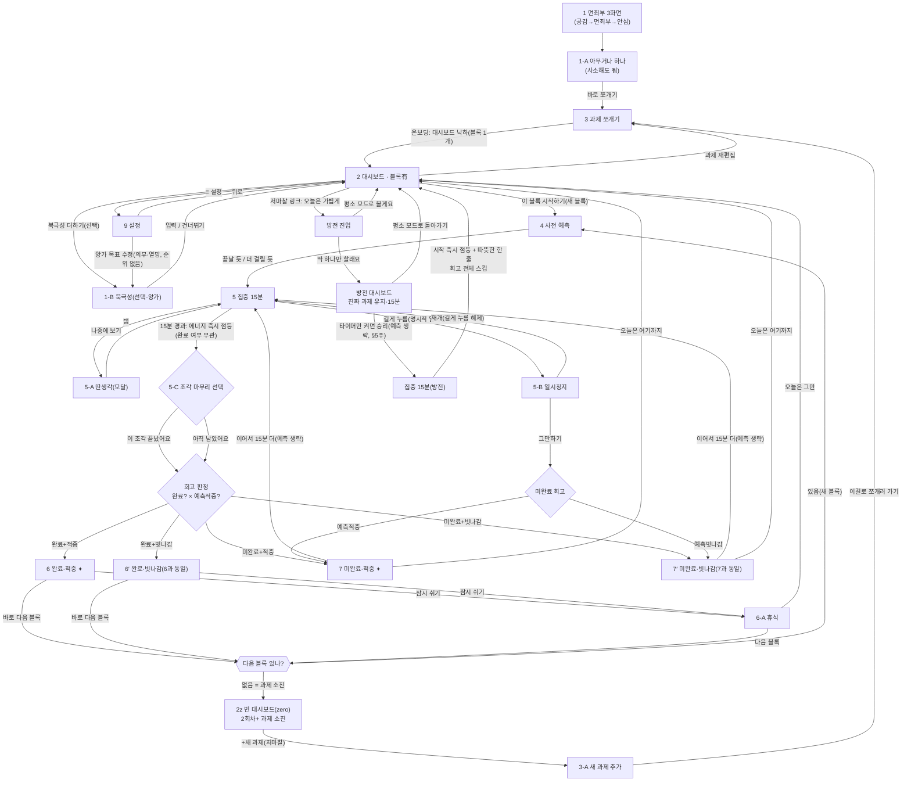

# 컴페이스 — 화면 흐름 명세 (Screen Flow Spec) v0.4

> **역할:** 화면 전이·상태·엣지케이스의 **논리 SSOT.** 와이어프레임(`컴페이스 와이어프레임.html`) = "어떻게 생겼나" / 이 문서 = "언제·왜·어디로 가나".
> **정본 경계:** 확정 스코프·규칙 = `SPEC.md` · 결정 근거 = `DECISIONS.md` · 의도 = `VISION.md` · 불변 규칙 = `/CLAUDE.md`.
> 판단 기준선: `/CLAUDE.md`(가드레일) · 페르소나 K.
> **정합 상태(v0.2):** 과거 열린 논리 이슈(P3·P4·P7·P8·P10)를 `SPEC.md` 확정본으로 **전부 승격**했다. 남은 것은 논리 공백이 아니라 **와이어 재작업**(SPEC §13)과 **밤/아침 pull 설계**(R3)뿐이다.

---

## 0-A. SPEC 정합 노트 (닫힌 이슈 = 전부)

`SPEC.md`(최신 확정본)가 이미 결정한 항목. 이 노트가 §4·과거 점선(❓)보다 우선한다.

| 이슈                                     | SPEC 결정                                                                                                                                                         | 반영                                |
| ---------------------------------------- | ----------------------------------------------------------------------------------------------------------------------------------------------------------------- | ----------------------------------- |
| **P1/P2** 온보딩 경로·직후 대시보드 상태 | `SPEC §2`: **면죄부 3화면 → "아무거나" 입력 → 쪼개기 → 대시보드(블록 1개) 낙하.** 북극성은 온보딩 필수 경로에서 제외(선택·건너뛰기). 타이머·회고는 온보딩 미포함. | §1·§2 반영                          |
| **P3** 블록 소진 종착                    | `SPEC §4·§6`: 과제 소진 → **빈 대시보드(zero)** 로 착지(2회차+). 하드 상한 ❌, 에너지 바 0에서 자람. dead-end 아님.                                               | §2·§3-4 반영                        |
| **P4** 미완료 "여기까지" 목적지          | `SPEC §6`: 도중 중단 = "못 했지만 괜찮아요" 이어하기 경로, "실패" 상태 영구 부재 → "오늘은 여기까지"는 **대시보드(2)** 로 착지(이월 블록은 다음날 그대로).        | §2·§3-2 반영                        |
| **P5/P6** 방전 모드 경로·회고            | `SPEC §5`: 승리조건만 완화("타이머만 켜면 승리"), **회고 전체 스킵**, 진짜 과제 보존, 발동 = 상시 저마찰 링크.                                                    | §2·§5 반영 (예측 취급은 §5 주 참조) |
| **P7** 세션 복구                         | `SPEC §6`: 15분 중 이탈(전화·앱 이탈·**강제종료**) = 타이머 **일시정지**(포그라운드에서만 흐름), 복귀 시 이어짐.                                                  | §2·§3-1 반영                        |
| **P8** "+새 과제" 잠금 해제              | `SPEC §3` + [`D-17`](DECISIONS.md#d-17)/CLAUDE §2 One Task: 큰 과제도 동시 1개, **현재 과제 소진 전 새 과제 ❌** → 잠금해제 조건 = 과제 소진(= zero 대시보드).    | §2·§3-4 반영                        |
| **P9** 에너지 바 상한·리셋               | `SPEC §6·§8`: 하드 상한 ❌, 0에서 자람(고정 5칸 폐기), 매일 리셋.                                                                                                 | §3-4 반영                           |
| **P10** 대시보드 시작 경로               | `SPEC §3·§6`: 새 블록 = **예측(4) 경유**, 이어하기 블록 = **예측 생략, 곧장 집중(5)**.                                                                            | §2·§3-1 반영                        |
| **P11** 설정 목표 단수/양가              | `SPEC §7`: 양가(의무·열망) 두 좌표, 순위 없음. 단수 "최종 목표" 폐기.                                                                                             | §1·§2 해소                          |
| **P12** 시간기반 완료 vs 완료/미완료     | [`D-09`](DECISIONS.md#d-09): 에너지 점등=시간기반(무조건), 완료/미완료=이월 판단용 별개 라벨(둘 다 같은 에너지).                                                  | §3-2 해소                           |
| **화면 8 기록/통계**                     | `SPEC §4·§12`: **MVP 제거**(→ post-MVP "증거 앨범").                                                                                                              | 인벤토리 제외                       |

**아직 열린 것 = 논리 아님:** ① 와이어 재작업(면죄부 3화면·zero 대시보드·에너지 바 자라는 형태·방전 상시 링크·설정 양가 목표 — SPEC §13) ② 밤/아침 pull 접점 설계(SPEC R3). → §6.

---

## 0-B. 표기 규칙

| 표기                         | 의미                                                |
| ---------------------------- | --------------------------------------------------- |
| **실선 →**                   | 확정 전이(SPEC 정합 완료)                           |
| `[신규]` `[재구성]` `[유지]` | 와이어프레임 상태 배지 승계                         |
| 🛡️                           | 가드레일 관측점 (`/CLAUDE.md` §2~§4 위반 위험 지점) |

> v0.2에서 과거 점선(❓Pn)은 전부 실선으로 승격됐다(§0-A). 남은 미확정은 **와이어 층**뿐이며 논리 전이엔 점선이 없다.

---

## 1. 화면·상태 인벤토리

논리 흐름 순서로 정렬. ID는 와이어프레임 배지 번호 승계. (화면 8 기록/통계 = MVP 제외.)

| ID                | 화면              | 섹션        | 목적                                                                                                   | 진입점                                   | 상태 변형                                           | 배지                                                     |
| ----------------- | ----------------- | ----------- | ------------------------------------------------------------------------------------------------------ | ---------------------------------------- | --------------------------------------------------- | -------------------------------------------------------- |
| **1**             | 면죄부 3화면      | A 온보딩    | 첫 진입 RSD 완충(공감→면죄부→안심)                                                                     | 신규 설치                                | `공감`/`면죄부`/`안심`                              | 신규                                                     |
| **1-A**           | 아무거나 하나     | A 온보딩    | 첫 과제 1줄 입력(사소해도 됨)                                                                          | 1                                        | –                                                   | 재구성(질문 교체)                                        |
| **1-B**           | 북극성 (선택)     | 재방문/선택 | 양가 목표(열망·의무) 선택·**건너뛰기 가능**                                                            | 2 대시보드(상단 선택) · 9 설정           | `열망만`/`의무만`/`둘 다`/`모르겠어요`/`비움`       | 재구성                                                   |
| **3**             | 과제 쪼개기       | B 실행      | 동사 칩으로 수동 15분 블록 생성                                                                        | 1-A(온보딩) · 2 · 3-A                    | –                                                   | 유지                                                     |
| **2**             | 대시보드(홈)      | B 실행      | 오늘의 One Task 제시 + 에너지 바 + 방전 링크                                                           | 온보딩완료 · 재진입 · 각 종료화면        | `북극성O/없음` × `블록有(정상)`/`zero(소진)`/`방전` | 재구성                                                   |
| **2z**            | 빈 대시보드(zero) | B 실행      | **2회차+ 과제 소진** 상태, "+새 과제" 저마찰 진입                                                      | NEXT(다음 블록 없음) · 재진입(과제 없음) | –                                                   | 해소(`AddTaskPrompt` 겸용, 별도 와이어 불요 — `PH-04.4`) |
| **3-A**           | 새 과제 추가      | B 실행      | 과제 소진 후 다음 과제 입력(One Task 유지)                                                             | 2z                                       | –                                                   | 해소(`AddTaskPrompt` 겸용, 별도 와이어 불요 — `PH-04.4`) |
| **4**             | 사전 예측         | B 실행      | "이번 15분에 끝날까?" 2지선다                                                                          | 3 · 2(새 블록) · NEXT(새 블록)           | `끝날 것 같다` / `더 걸릴 듯`                       | 유지                                                     |
| **5**             | 집중 화면         | B 실행      | 15분 타이머 실행. 이탈해도 흐름 유지된다는 저대비 상시 안내(P15)                                       | 4 · 이어하기(예측 생략 직행)             | `진행` / `일시정지(5-B)` / `딴생각모달(5-A)`        | 유지                                                     |
| **5-A**           | 딴생각 포착       | C 이탈      | 스친 생각 1줄 저장(타이머 **안 멈춤**) + 다음 조각 예약 겸용(일 조기 완료 시, P16), 종료 후 1회성 표시 | 5 (탭)                                   | 모달                                                | 유지·모달                                                |
| **5-B**           | 일시정지          | C 이탈      | 타이머 멈춤(앱 이탈·강제종료 시 자동), 재개/그만                                                       | 5 (길게·백그라운드)                      | –                                                   | 유지                                                     |
| **5-C**           | 조각 마무리 선택  | D 회고      | 15분 자연 경과 시 완료/이어가기 라벨을 **사용자가** 결정(시스템 자동판정 금지, P14)                    | 5 (15분 경과, 에너지 이미 점등)          | `이 조각 끝났어요` / `아직 남았어요`                | 신규                                                     |
| **6**             | 완료·적중         | D 회고      | 완료 + 예측적중 → 보너스 카드 조용히                                                                   | 5-C                                      | –                                                   | 재구성                                                   |
| **6′**            | 완료·빗나감       | D 회고      | 완료 + 예측빗나감 → **6과 완전 동일(무표시)**                                                          | 5-C                                      | –                                                   | 신규                                                     |
| **6-A**           | 휴식              | D 회고      | 5분 휴식 후 다음 블록 or 종료                                                                          | 6 · 6′ (잠시 쉬기)                       | –                                                   | 유지                                                     |
| **7**             | 미완료·적중       | D 회고      | 미완료(이월) + 예측적중 → 보너스                                                                       | 5-C · 5-B 그만                           | –                                                   | 재구성                                                   |
| **7′**            | 미완료·빗나감     | D 회고      | 미완료(이월) + 예측빗나감 → **7과 완전 동일(무표시)**                                                  | 5-C · 5-B 그만                           | –                                                   | 신규                                                     |
| **방전 진입**     | 방전 진입         | F 방전      | 저전력의 날 승리조건 완화 안내                                                                         | 2 (상시 저마찰 링크)                     | –                                                   | 신규                                                     |
| **방전 대시보드** | 방전 대시보드     | F 방전      | 진짜 과제 유지·15분 유지·색 차분, **회고 스킵**                                                        | 방전 진입                                | –                                                   | 신규                                                     |
| **9**             | 설정              | E 재방문    | 양가 목표(둘 다 선택)·라벨·알림(기본 OFF)                                                              | 2 (≡ 메뉴)                               | –                                                   | 재구성                                                   |

> **핵심 상태 축(이 앱은 상태가 곧 제품):**
> ① 대시보드 = **두 축**(북극성 有/無 × 블록 有(정상)/zero(소진)) + 방전 ② 타이머 3상태(진행/일시정지/딴생각) ③ 회고 4조합(완료·미완료 × 적중·빗나감) ④ 에너지 바(완료/미완료 **색 동일** — 🛡️§2 실패 무처벌)

---

## 2. 전체 흐름도 (Mermaid)

> 실선 = SPEC 확정. **막다른 화면 금지 원칙** 검증 완료(모든 노드 출구 존재). 온보딩(P1/P2)·방전(P5/P6)·루프 종료(P3/P4/P8/P10)는 `SPEC.md` 결정으로 정합.

---

## 3. 상태 전이표 (핵심 상태 화면)

"현재상태 × 이벤트 → 다음상태". v0.2에서 미정의(`?`) 없음 — 전부 SPEC로 확정.

### 3-1. 타이머 (화면 5) — P7/P10 반영

| 현재 상태     | 이벤트                            | 다음 상태                                   | 비고 / 🛡️                                                                                                                                                       |
| ------------- | --------------------------------- | ------------------------------------------- | --------------------------------------------------------------------------------------------------------------------------------------------------------------- |
| 진행          | 15분 경과                         | 에너지 즉시 점등 + **5-C 조각 마무리 선택** | 🛡️§3 즉각성 — 점등은 그 순간 조용히, 완료 라벨 판정은 5-C가 담당(지연 없이 점등 먼저, **P14**)                                                                  |
| 5-C           | "이 조각 끝났어요"                | 회고 판정(6/6′)                             | 완료 라벨, 이월 없음 — **P14**                                                                                                                                  |
| 5-C           | "아직 남았어요"                   | 회고 판정(7/7′)                             | 미완료 라벨, 이월 판단용. "이어서 15분 더"/"오늘은 여기까지"는 기존 그대로 — **P14**                                                                            |
| 진행          | 딴생각 탭                         | 5-A 모달 (타이머 유지)                      | 타이머 안 멈춤. 다음 조각 예약 겸용(**P16**)                                                                                                                    |
| 진행          | **길게 누름(명시적 일시정지만)**  | 5-B 일시정지 (타이머 멈춤)                  | 유일한 정지 트리거                                                                                                                                              |
| 진행          | **화면잠금·앱이탈·전화·강제종료** | **진행 유지(계속 흐름)**                    | 시작 시각 기준 경과. 복귀 <15분=이어짐, ≥15분=에너지 점등+5-C, 익일/장시간=미완료 이월(침묵). 이탈 가능성은 화면 5에 상시 저대비 고지(**P15**). SPEC §6·**P13** |
| 일시정지(5-B) | 재개(길게 누름 해제)              | 진행 (이어짐)                               | 명시적 정지의 재개만                                                                                                                                            |
| 일시정지(5-B) | 그만하기                          | 7/7′ 미완료                                 | 🛡️§2 무처벌 — "그만"도 에너지 점등                                                                                                                              |
| 딴생각(5-A)   | 나중에 보기                       | 진행 복귀 (메모는 종료 후 1회성 표시)       | 상주 목록 ❌ (SPEC §6)                                                                                                                                          |
| 이어하기 블록 | 시작                              | **집중(5) 직행 — 예측(4) 생략**             | SPEC §6                                                                                                                                                         |
| 새 블록       | 시작                              | 사전 예측(4) 경유                           | SPEC §3 (P10)                                                                                                                                                   |

### 3-2. 회고 판정 (예측 × 결과)

| 예측 \ 결과        | 완료                         | 미완료(이월)                 |
| ------------------ | ---------------------------- | ---------------------------- |
| **"끝날 것 같다"** | **6 적중 ✦** (보너스)        | 6′ 빗나감 (무표시, 6과 동일) |
| **"더 걸릴 듯"**   | 7′ 빗나감 (무표시, 7과 동일) | **7 적중 ✦** (보너스)        |

> 🛡️§2/§3: 빗나감(6′·7′)은 **배지·박스 없이 완료 화면과 완전 동일**. 보너스는 적중일 때만 조용히. 사회적 관객 없음.
> **회고 종료 후:** "잠시 쉬기"→6-A · "바로 다음 블록"→다음 블록 분기(§3-4) · 미완료 "오늘은 여기까지"→대시보드(2, 이월 블록은 다음날 그대로) — SPEC §6, **P4 해소**.
> **P12 해소:** 에너지 점등은 시간기반(무조건), 완료/미완료는 이월 판단용 별개 라벨(둘 다 같은 에너지). → [`D-09`](DECISIONS.md#d-09).
> **P14 해소:** 그 라벨을 확정하는 주체는 시스템 자동판정이 아니라 **사용자**(5-C 조각 마무리 선택) — 자연 종료·조기 이탈(그만하기) 모두 동일 원칙, 15분 floor 자체는 불변(§2·D-15).

### 3-3. 대시보드 변형 (화면 2) — 두 축

**축1(북극성)과 축2(블록 유무)는 직교.** 방전은 별도 모드.

| 축     | 변형           | 표시                                                                            |
| ------ | -------------- | ------------------------------------------------------------------------------- |
| 북극성 | `북극성O`      | 상단 정적 열망/의무 라벨(선택). 진행 측정 ❌ (SPEC §9)                          |
| 북극성 | `북극성없음`   | 라벨 없음, "북극성 더하기(선택·초대 톤)"만                                      |
| 블록   | `블록有(정상)` | One Task 1개 노출 + 에너지 바 + 방전 링크 (온보딩 직후 = 이 상태, SPEC §2)      |
| 블록   | `zero(소진)`   | **2회차+ 과제 소진 시만.** 블록 없음 → "+새 과제" 저마찰 (화면 2z, 별도 와이어) |
| 모드   | `방전`         | 색 차분, 승리조건 "시작=승리", 15분 유지, 회고 스킵                             |

### 3-4. 블록/과제 수명주기 — P3/P8 반영

| 현재           | 이벤트                        | 다음                                       | 근거                                                                       |
| -------------- | ----------------------------- | ------------------------------------------ | -------------------------------------------------------------------------- |
| 과제 쪼갬(3)   | 블록 N개 생성                 | 대시보드에 첫 블록 노출                    |                                                                            |
| 블록 진행      | 완료/미완료                   | 회고 → 다음 블록 분기                      |                                                                            |
| 다음 블록 분기 | 남은 블록 **있음**            | 사전 예측(4) → 집중                        | SPEC §3                                                                    |
| 다음 블록 분기 | 남은 블록 **없음**(과제 소진) | **빈 대시보드(zero) → +새 과제**           | SPEC §4·§6 (P3)                                                            |
| 현재 과제 소진 | +새 과제                      | 3-A → 쪼개기(3)                            | One Task 유지: 소진 전 새 과제 ❌ (SPEC §3, [D-17](DECISIONS.md#d-17), P8) |
| 에너지 바      | 블록 종료                     | 한 칸 점등(0에서 자람, 상한 ❌, 매일 리셋) | SPEC §6·§8 (P9)                                                            |

---

## 4. 논리 이슈 대장 (전부 해소)

> 🟢 = `SPEC.md`/`DECISIONS.md`로 해소. **P13(D-26 파생)까지 해소 — 열린 논리 이슈 없음.**

| #       | 이슈                                         | 상태                                                                                                                                                                                                                                                                                                                                                                                                                                                                                                                                                                                                                  |
| ------- | -------------------------------------------- | --------------------------------------------------------------------------------------------------------------------------------------------------------------------------------------------------------------------------------------------------------------------------------------------------------------------------------------------------------------------------------------------------------------------------------------------------------------------------------------------------------------------------------------------------------------------------------------------------------------------- |
| **P1**  | 온보딩 경로                                  | 🟢 SPEC §2 (면죄부 3화면→아무거나→쪼개기→대시보드; 북극성 건너뛰기)                                                                                                                                                                                                                                                                                                                                                                                                                                                                                                                                                   |
| **P2**  | 온보딩 직후 대시보드 상태                    | 🟢 SPEC §2 (블록 1개 있는 상태)                                                                                                                                                                                                                                                                                                                                                                                                                                                                                                                                                                                       |
| **P3**  | 블록 소진 종착                               | 🟢 SPEC §4·§6 (빈 대시보드 zero → +새 과제, dead-end 아님)                                                                                                                                                                                                                                                                                                                                                                                                                                                                                                                                                            |
| **P4**  | 미완료 "여기까지" 목적지                     | 🟢 SPEC §6 (대시보드(2), 이월 블록 다음날 그대로) — **MVP 경계(2026-07-08 감사)**: 세션 내 이월(중단 조각 큐 복귀, [PH-06.1](PH-06.1-carryover-requeue.md))만 보장, 재부팅 후 "다음날 그대로"는 post-MVP(큐 영속, SPEC §6 주·§12)                                                                                                                                                                                                                                                                                                                                                                                     |
| **P5**  | 방전 "평소 모드로" 목적지                    | 🟢 SPEC §5 (대시보드 2)                                                                                                                                                                                                                                                                                                                                                                                                                                                                                                                                                                                               |
| **P6**  | 방전 대시보드 경로·회고                      | 🟢 SPEC §5 (회고 전체 스킵, 예측 생략 §5주)                                                                                                                                                                                                                                                                                                                                                                                                                                                                                                                                                                           |
| **P7**  | 세션 복구(강제종료·백그라운드)               | 🟢 SPEC §6 개정 (계속 흐름, 복귀 시 경과 반영 — 시작시각 재계산) + P13                                                                                                                                                                                                                                                                                                                                                                                                                                                                                                                                                |
| **P8**  | "+새 과제" 잠금 해제 조건                    | 🟢 SPEC §3 + [D-17](DECISIONS.md#d-17) (과제 소진 시, One Task 유지)                                                                                                                                                                                                                                                                                                                                                                                                                                                                                                                                                  |
| **P9**  | 에너지 바 상한·리셋                          | 🟢 SPEC §6·§8 (상한 없음, 0에서 자람, 매일 리셋)                                                                                                                                                                                                                                                                                                                                                                                                                                                                                                                                                                      |
| **P10** | 대시보드 시작 경로                           | 🟢 SPEC §3·§6 (새 블록=예측 경유, 이어하기=예측 생략 직행)                                                                                                                                                                                                                                                                                                                                                                                                                                                                                                                                                            |
| **P11** | 설정 목표 단수 vs 양가                       | 🟢 SPEC §7 (양가 두 좌표)                                                                                                                                                                                                                                                                                                                                                                                                                                                                                                                                                                                             |
| **P12** | 시간기반 완료 vs 완료/미완료                 | 🟢 [D-09](DECISIONS.md#d-09)                                                                                                                                                                                                                                                                                                                                                                                                                                                                                                                                                                                          |
| **P13** | 물리적 단절(D-12) ↔ 포그라운드 정지(§6) 충돌 | 🟢 **B안: 타임스탬프 카운팅**(§6 개정, 명시적 일시정지만 멈춤). 근거: D-09 시간기반 충실·D-12 제스처 실작동·배터리(K)·§6 딴짓방지 무가치(무처벌·무관객)·P7 단순화                                                                                                                                                                                                                                                                                                                                                                                                                                                     |
| **P14** | 자연 종료 시 완료/이어가기 판정 주체         | 🟢 **5-C 조각 마무리 선택 신설**(2026-07-14, PH-11 이후 실사용 감사). 기존엔 15분 자연 경과 시 시스템이 무조건 `completed:true`로 자동 확정 — "이어서 15분 더"(7/7′)가 조기 이탈("그만하기")로만 도달 가능한 비대칭이었음(열심히 15분을 채운 쪽이 오히려 이어가기 옵션을 못 받는 역전). 에너지 점등은 여전히 완료 여부 무관 즉시(D-09 그대로), 5-C는 그 **이후** 라벨만 확인. 질문은 "다 됐나요?"(사람 판정)가 아니라 조각의 상태를 묻는 2지선다("이 조각 끝났어요"/"아직 남았어요") — 검사형 문구 금지(§4)와 충돌하지 않도록 프레이밍. 15분 floor 자체는 불변(D-15, 조기 완료 버튼은 별도 논의 후 기각 — 아래 참조). |
| **P15** | 집중 중 이탈 가능성 미고지                   | 🟢 P13(타임스탬프 카운팅 — 앱 이탈·화면잠금·전화 중에도 계속 흐름)은 이미 구현돼 있으나, 화면 5에 이 사실을 알리는 문구가 전혀 없어 사용자가 "화면 앞에 붙들려 있다"고 오인할 위험. `text.quiet`(저대비 조용 요소, DESIGN-TOKENS §10.3) 톤의 상시 안내 문구로 고지 — 상시 노출이라도 저대비·소형이라 §6 "집중 화면 볼거리 금지"와 충돌 없음.                                                                                                                                                                                                                                                                          |
| **P16** | 딴생각 포착(5-A)의 용도 협소                 | 🟢 "스친 생각"(산만함) 전용으로만 읽히던 목적 문구를, "일이 일찍 끝났을 때 다음 조각 아이디어 적어두기"까지 포괄하도록 확장 — 메커니즘(캡처 → 회고에서 "새 조각화" → 큐 편입)은 기존 그대로, 신규 기능 없음.                                                                                                                                                                                                                                                                                                                                                                                                          |

**조기 완료 버튼 기각(확정, 2026-07-14):** "일이 15분 전에 끝나면 바로 완료 처리할 수 있게 해달라"는 요청을 검토했으나 **채택하지 않는다.** 근거 — D-15(15분 단일 고정은 연장 차단과 한 몸, "이 정도면 됐다" 조기 이탈은 완벽주의 탈출구를 다시 여는 것)·D-09(체크리스트/개수 상한 대안을 이미 기각한 논리와 동일 — 개수·조기종료 기반은 시작 압박+완벽주의 결합을 재도입). 설계 기준선 페르소나 K(VISION §3)의 실패 모드는 "너무 빨리 끝내고 싶어함"이 아니라 "애초에 시작을 못 함"이라 이 요청은 오히려 고에너지 페르소나(A)에 가깝고 K 최적화 원칙(CLAUDE §1)과 어긋난다. 대신 P14(자연 종료 시 이어가기 선택)·P15(이탈 가능 고지)·P16(딴생각 포착의 다음 조각 예약 겸용)로 "일찍 끝났을 때의 답답함"을 15분 floor를 건드리지 않고 해소한다.

**방전 모드 예측 생략(확정):** 방전에서는 사전 예측(4)을 **생략**한다. 근거 — SPEC §5가 **회고 전체 스킵**을 확정하면서 예측값을 대조할 회고가 사라졌고(예측의 유일한 쓸모 소멸), **마찰 최소화**(CLAUDE §4)·**결정 피로 차단**(CLAUDE §2)에 따라 저전력의 날에 판단 1단계를 더 얹지 않는다. (과거 v0.1의 "예측/집중만" 해석은 폐기.)

---

## 5. 방전 모드 상세 (SPEC §5 정합)

- **경로:** 방전 진입 → (딱 하나만) 방전 대시보드 → 집중 15분 → 시작 즉시 점등 + 따뜻한 한 줄 → 대시보드. "평소 모드로 볼게요/돌아가기" = 언제나 대시보드(2).
- **예측:** **생략(확정).** 회고 스킵과 한 몸 — 대조할 회고가 없으므로 예측 단계 자체를 제거(마찰 최소화).
- **회고:** **전체 스킵**(영점조절·예측보너스·이월) — 시작 점등 + 한 줄로 종료.
- **에너지 바:** 시작 순간 즉시 점등, 정상 블록과 **시각적으로 동일**(🛡️§2 무처벌).
- **진짜 과제:** 보존(치환·소모 ❌). 다음날 그대로. ([D-18](DECISIONS.md#d-18) 원안 = 승리조건 완화.)
- **발동:** 상시 노출 저마찰 링크("오늘은 가볍게 갈까요") — '고장' 라벨 ❌.

---

## 6. 가드레일 교차검증 (신규 전이 추가 시 필수)

이제 논리 공백이 아니라 **구현 시 지킬 관측점**이다.

- **블록 소진 → zero(P3)**: "과제 다 했어요!" 결과 축하 유혹 → 🛡️ **결과 칭찬 금지(§4), 과정만**. zero는 담백한 "오늘의 증거" + 저마찰 새 과제, 성적표 프레임 ❌.
- **세션 복구 → 재진입(P7)**: "돌아왔으니 이어서!" 유도 → 🛡️ **잔소리·재접속 유도 금지(§4)**. 며칠 만이면 "다시 와줘서 반가워요"만. 복귀는 조용히 이어짐.
- **대시보드 시작(P10)**: 게이지·레벨업 연출 유혹 → 🛡️ **볼거리 추가 금지(§6), 즉시성은 전환(회고·점등) 순간에만**.
- **방전**: 승리조건만 완화, **15분·침묵·무처벌·예측생략 외 규칙은 그대로**(§2).
- **밤/아침 pull(R3)**: 접점은 **pull만, push ❌**(§4). 재접속 알림으로 새지 않게.

---

## 7. 다음 단계 (와이어·설계 층만)

논리 SSOT는 SPEC 정합 완료. 남은 것은 이 문서 밖 작업이다.

1. **와이어 재작업**(SPEC §13, 완료): 면죄부 3화면 복원 · 온보딩 첫 질문 교체 · 빈 대시보드(zero, `AddTaskPrompt` 겸용으로 해소 — `PH-04.4`) · 에너지 바 자라는 형태 · 방전 상시 링크 · 설정 양가 목표 · 기록 페이지 삭제.
2. **밤/아침 pull 접점 설계**(SPEC R3 / DECISIONS 부록C) — push 없이 자연 조우.
3. ~~6-A(휴식) 구현~~ — `PH-05.2`(2026-07-12) 완료. `RestPage`(`routes/paths.ts` `rest: '/rest'`) 구현, `RetroPage` 완료 경로에 "잠시 쉬기"/"바로 다음 블록" 2버튼 반영.
4. 확정 시 와이어프레임 캡션을 이 문서 전이에 역동기화.

> v0.2 — SPEC 정합 완료(P3·P4·P7·P8·P10 승격, 온보딩·방전·zero 대시보드 반영). 확정 규칙은 `SPEC.md`가 정본.

---

## Changelog

- **v0.6(2026-07-14)** — **PH-11 이후 실사용 감사로 P14/P15/P16 신설·해소.** 15분 자연 종료 시 시스템이 완료 여부를 사용자에게 묻지 않고 무조건 확정하던 갭을 발견(조기 이탈로만 "이어서 15분 더"에 도달 가능했던 비대칭) — **5-C 조각 마무리 선택** 신설(§1 인벤토리·§2 mermaid·§3-1 전이표), 에너지 점등을 완료 판정과 분리해 지연 없이 먼저 쏘도록 명시(P14). 집중 화면에 이탈 가능성을 알리는 저대비 상시 안내 추가(P15, §1 화면 5). 딴생각 포착(5-A)의 목적을 "다음 조각 예약" 겸용으로 확장(P16). "조기 완료 버튼" 요청은 D-15·D-09·페르소나 K 적합성 근거로 검토 후 기각, §4에 기록. 코드 변경 없음(문서만, 구현은 별도 위상에서 착수 예정).
- **v0.5(2026-07-12)** — **문서 정합성 감사 반영(코드 diff 없음).** §7 "다음 단계" 3번이 `PH-05.2` 완료(같은 날) 이후에도 "6-A(휴식) 코드 미구현" 미해결 항목으로 남아 있던 드리프트를 발견·취소선 처리(구현 완료 표기).
- **v0.4(2026-07-12)** — `PH-05.2` 소급 감사 반영. §1 인벤토리의 2z·3-A 배지를 "신규(와이어 필요)"/"재구성"에서 "해소(`AddTaskPrompt` 겸용, 별도 와이어 불요 — `PH-04.4`)"로 정정(코드 변경 없음, 표기만 갱신 — `PH-04.4`가 이미 내린 판정이 이 문서에 되먹임되지 않고 있던 드리프트). §7 "다음 단계"에서 해소된 "빈 대시보드(zero) 신규" 항목을 제거하고, 실재하는 유일한 갭인 6-A(휴식) 구현을 추적 항목으로 신설.
- **v0.3** — P13 신규·해소: D-12(물리적 단절)↔SPEC §6(포그라운드 정지) 충돌을 **타임스탬프 카운팅(B안)**으로 봉합(§6 개정 — 백그라운드=계속 흐름, 명시적 일시정지만 정지). §2 Mermaid·§3-1 전이표·§4 P7/P13 정합. 플랫폼 결정 [D-26](DECISIONS.md#d-26) 반영.
- **v0.2** — `SPEC.md` 전면 정합. 열린 논리 이슈(P3·P4·P7·P8·P10) 전부 🟢 승격. 온보딩 경로를 SPEC §2(면죄부 3화면→아무거나→쪼개기→대시보드, 북극성 온보딩 경로 제외)로 교체. 빈 대시보드(zero) 신규 노드·수명주기 반영. 세션 복구(강제종료→일시정지)·다음 블록 분기(예측 경유 vs 이어하기 직행) 확정. 방전 예측 생략 확정. 점선(❓) 전면 실선화.
- **v0.1** — 초안. 와이어프레임 기준 화면 인벤토리·흐름도·전이표 + P1~P12 논리 이슈 식별.
