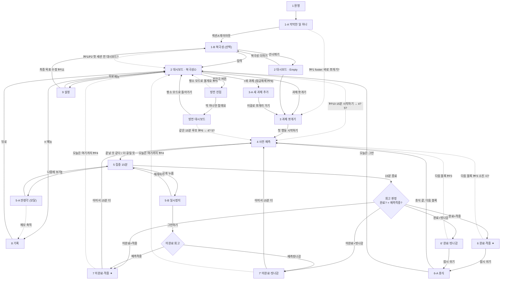

# 컴페이스 — 화면 흐름 명세서 (Screen Flow Spec) v0.1 draft

> **목적**: 와이어프레임(`컴페이스 와이어프레임.html`)이 "룩앤필"은 잘 담고 있으나, 전이·상태·엣지케이스의 **논리**를 담지 못한다. 이 문서는 그 논리의 **단일 진실 원천(SSOT)** 초안이다.
> **역할 분리**: 와이어프레임 = "어떻게 생겼나" / 이 문서 = "언제·왜·어디로 가나".
> 판단 기준선: `CLAUDE.md`(가드레일) · 페르소나 K.

---

## 0. 표기 규칙

| 표기 | 의미 |
|------|------|
| **실선 →** | 와이어프레임에 정의된 전이 |
| **점선 -.-> / ❓** | 와이어프레임에 **미정의·모순·추정**인 전이 (아래 §4 이슈와 연결) |
| `[신규]` `[재구성]` `[유지]` | 와이어프레임의 화면 상태 배지 승계 |
| 🛡️ | 가드레일 관측점 (CLAUDE.md §2~§4 위반 위험 지점) |
| **Pn** | 미해결 논리 이슈 번호 (§4) |

---

## 1. 화면·상태 인벤토리

와이어프레임 순서가 아니라 **논리 흐름 순서**로 정렬. ID는 와이어프레임 배지 번호를 그대로 승계.

| ID | 화면 | 섹션 | 목적 | 진입점 | 상태 변형 | 배지 |
|----|------|------|------|--------|-----------|------|
| **1** | 환영 | A 온보딩 | 첫 진입, 막막한 일 하나로 유도 | 신규 설치 | – | (신규) |
| **1-A** | 막막한 일 하나 | A 온보딩 | 첫 큰 과제 1줄 입력 | 1 | – | (신규) |
| **1-B** | 북극성 | A 온보딩 | 양가 목표(열망/의무) 선택·**건너뛰기 가능** | 1-A · 9설정 | `열망만`/`의무만`/`둘 다`/`아직 모르겠어요`/`건너뜀` | (신규) |
| **2** | 대시보드 | B 실행 | 오늘의 One Task 제시 | 온보딩완료 · 재진입 · 각 종료화면 | `북극성O` / `Empty(북극성없음)` / **`온보딩직후(블록 미생성)` ❓P2** | 재구성 / 신규(Empty) |
| **3-A** | 새 과제 추가 | B 실행 | 현재 과제 소진 후 다음 큰 과제 입력 | 2 (+새 과제, **잠금 해제 시** ❓P8) | – | 재구성 |
| **3** | 과제 쪼개기 | B 실행 | 동사 칩으로 수동 15분 블록 생성 | 2 · 3-A | – | 유지 |
| **4** | 사전 예측 | B 실행 | "이번 15분에 끝날까?" 2지선다 | 3 · 2 · 6·6′·7·7′·6-A · 방전 | `끝날 것 같다` / `더 걸릴 듯` | 유지 |
| **5** | 집중 화면 | B 실행 | 15분 타이머 실행 | 4 | `진행` / `일시정지(5-B)` / `딴생각모달(5-A)` | 유지 |
| **5-A** | 딴생각 포착 | C 이탈 | 스친 생각 1줄 저장(타이머 **안 멈춤**), 기록(8)에 축적 | 5 (탭) | 모달 | 유지·모달 |
| **5-B** | 일시정지 | C 이탈 | 타이머 멈춤, 재개/그만 | 5 (길게) | – | 유지 |
| **6** | 완료·적중 | D 회고 | 완료 + 예측적중 → 보너스 카드 조용히 | 5 종료 | – | 재구성 |
| **6′** | 완료·빗나감 | D 회고 | 완료 + 예측빗나감 → **6과 완전 동일(무표시)** | 5 종료 | – | 신규 |
| **6-A** | 휴식 | D 회고 | 5분 휴식 후 다음 블록 or 종료 | 6 · 6′ (잠시 쉬기) | – | 유지 |
| **7** | 미완료·적중 | D 회고 | 미완료(이월) + 예측적중 → 보너스 | 5 종료 · 5-B 그만 | – | 재구성 |
| **7′** | 미완료·빗나감 | D 회고 | 미완료(이월) + 예측빗나감 → **7과 완전 동일(무표시)** | 5 종료 · 5-B 그만 | – | 신규 |
| **방전 진입** | 방전 진입 | F 방전 | 저전력의 날 승리조건 완화 안내 | 2 (저자극 버튼) | – | 신규 |
| **방전 대시보드** | 방전 대시보드 | F 방전 | 딱 하나만, 15분 유지·색 차분 | 방전 진입 | – | 신규 |
| **8** | 기록/통계 | E 재방문 | 누적 에너지·포착 생각 열람 | 2 (≡ 메뉴) | – | 유지 |
| **9** | 설정 | E 재방문 | 목표·라벨(모두 선택)·알림(기본 OFF) | 2 (≡ 메뉴) | – | 재구성 |

> **핵심 상태 축(이 앱은 상태가 곧 제품):**
> ① 대시보드 3변형(북극성O / Empty / 방전) ② 타이머 3상태(진행/일시정지/딴생각) ③ 회고 4조합(완료·미완료 × 적중·빗나감) ④ 에너지 바(완료/미완료 **색 동일** — 🛡️§2 실패 무처벌)

---

## 2. 전체 흐름도 (Mermaid)

> 실선 = 정의됨 / 점선 = 미정의·모순(§4의 P번호). **막다른 화면 금지 원칙(와이어프레임 footer)** 검증용.

---

## 3. 상태 전이표 (핵심 상태 화면)

와이어프레임이 못 박지 못한 **"현재상태 × 이벤트 → 다음상태"**를 강제로 표로 드러낸다. `?` = 미정의 = 논리 버그 후보.

### 3-1. 타이머 (화면 5)

| 현재 상태 | 이벤트 | 다음 상태 | 비고 / 🛡️ |
|-----------|--------|-----------|-----------|
| 진행 | 15분 경과 | 회고 판정(6/6′/7/7′) + 에너지 즉시 점등 | 🛡️§3 즉각성 — 종료 그 순간 조용히 |
| 진행 | 딴생각 탭 | 5-A 모달 (타이머 유지) | 타이머 안 멈춤 |
| 진행 | 길게 누름 | 5-B 일시정지 (타이머 멈춤) | |
| 진행 | **앱 이탈/백그라운드** | **? ❓P7** | 타이머 계속? 복귀 시 5로? |
| 일시정지(5-B) | 재개 | 진행 | |
| 일시정지(5-B) | 그만하기 | 7/7′ 미완료 | 🛡️§2 무처벌 — "그만"도 에너지 점등 |
| 일시정지(5-B) | **앱 종료 후 재오픈** | **? ❓P7** | 일시정지 복구? 대시보드? |
| 딴생각(5-A) | 나중에 보기 | 진행 복귀 + 메모→기록(8) | |

### 3-2. 회고 판정 (예측 × 결과) — 와이어프레임 §D 표 승계

| 예측 \ 결과 | 완료 | 미완료(이월) |
|-------------|------|--------------|
| **"끝날 것 같다"** | **6 적중 ✦** (보너스) | 6′ 빗나감 (무표시, 6과 동일) |
| **"더 걸릴 듯"** | 7′ 빗나감 (무표시, 7과 동일) | **7 적중 ✦** (보너스) |

> 🛡️§2/§3: 빗나감(6′·7′)은 **배지·박스 없이 완료 화면과 완전 동일**. 보너스는 적중일 때만 조용히. 사회적 관객 없음(§3 anti-goal).
> ⚠️ **P12 — 판정 주체·시점 미정의**: "완료/미완료"는 15분 종료 후 사용자가 "다 했어요/못 했지만 괜찮아요"로 **자기보고**하는 값인가? CLAUDE.md §2 "시간 기반 완료(15분 채우면 100% 완료)"와의 관계 정리 필요. → 해석 초안: **에너지 점등은 시간기반(무조건)**, **완료/미완료는 이월 판단용 별개 라벨**(둘 다 같은 에너지). 확정 필요.

### 3-3. 대시보드 변형 (화면 2)

| 조건 | 변형 | 표시 |
|------|------|------|
| 북극성 입력함 | `북극성O` | 열망/의무 배지 + "지금 여기" 라벨 |
| 북극성 건너뜀/비움 | `Empty` | 배지·라벨 없음, "북극성 더하기(선택)"만 |
| 저전력의 날 진입 | `방전` | 색 차분, 승리조건 1개, 15분 유지 |
| **온보딩 직후(첫 쪼개기 전)** | **? ❓P2** | 블록이 아직 없는데 "지금 떼면 좋은 단 하나"를 어떻게 채우나? |

### 3-4. 블록/과제 수명주기

| 현재 | 이벤트 | 다음 | 미정의 |
|------|--------|------|--------|
| 과제 쪼갬(3) | 블록 N개 생성 | 대시보드에 첫 블록 노출 | |
| 블록 진행 | 완료/미완료 | 다음 블록 예측(4) | **다음 블록 없음 → ? ❓P3** |
| 모든 블록 소진 | – | **? (과제 완료 축하? 새 과제 잠금해제?)** | ❓P3/P8 |
| 현재 과제 다 쪼갬 | – | +새 과제 잠금해제 조건 = ? | ❓P8 |

---

## 4. 미해결 논리 이슈 (우선순위순)

와이어프레임에서 발견된 **공백·모순·dead-end 후보**. "막다른 화면 없음" 원칙을 지키려면 아래를 닫아야 한다.

| # | 이슈 | 위치 | 유형 | 영향 |
|---|------|------|------|------|
| **P1** | 온보딩 경로 충돌: 1-A 다음이 **1-B 북극성**(섹션A 레이아웃)인가 **3 쪼개기**(footer "1-A→3")인가. 환영은 "핵심 루프 먼저 경험"이라 하고, 1-B를 첫 세션 전에 두면 §2 결정피로와 모순 🛡️§2 | A | **모순** | 첫인상 전체 |
| **P2** | 온보딩 직후 대시보드 상태 미정의. 첫 사용자는 아직 쪼개지 않았는데 대시보드엔 이미 블록("지원동기 1문단")이 있음. **빈 대시보드(과제만 있고 블록 없음)** 상태 필요 | A→B | **공백** | 첫 세션 진입 |
| **P3** | "다음 블록"의 종착: 6·6′·7·7′·6-A 모두 "다음 블록→4"인데, **블록 소진/과제 완료 시** 처리 없음 → dead-end 위험 | D | **dead-end** | 루프 종료 |
| **P4** | 7·7′ "오늘은 여기까지" 목적지 **화살표 없음** (6-A는 "→2" 명시). 2 추정이나 미확정 | D | **미표기** | 종료 경로 |
| **P5** | 방전 진입 "평소 모드로 볼게요" 캡션이 "→ 방전 대시보드로"로 되어 있어 **버튼 문구와 목적지 모순**. 평소 모드면 2여야 함 | F | **모순** | 방전 이탈 |
| **P6** | 방전 대시보드 "같은 15분 루프"가 **4(예측) 경유인지 5(집중) 직행인지** 미표기. 또한 방전 세션의 **회고 경로(6/7 4조합 재사용? 별도?)** 미정의 | F | **공백** | 방전 전체 |
| **P7** | **앱 이탈/재오픈 시 진행 중 세션 복구** 전면 미정의 (진행/일시정지/딴생각 모달 상태에서 이탈). 며칠 만의 재방문(침묵+환영)과는 별개 문제 | 5 | **공백** | 세션 안정성 |
| **P8** | "+새 과제" **잠금 해제 조건** 미정의. "현재 과제를 다 쪼갠 뒤"인지 "모든 블록 소진 뒤"인지 불명확. §2 "동시 1개 과제"와 연결 | B | **공백** | 과제 전환 |
| **P9** | 에너지 바 5칸의 **상한·리셋 주기** 미정의 (일 단위? 5칸 다 차면? 방전은 1칸). 6/6′/7/7′은 4칸+보너스로 표시 | 전역 | **공백** | 보상 일관성 |
| **P10** | 대시보드 "15분 시작하기"가 **4(예측) 경유인지 5(집중) 직행인지** 미표기. 3의 "첫 행동 시작하기"는 4로 감 → 일관성 확인 | 2 | **미표기** | 재진입 루프 |
| **P11** | 설정의 목표는 **단수("최종 목표")**로 보이나 1-B는 **양가 2개(열망/의무)**. "수정→1-B" 시 표현 불일치. §5 "단수 강요 금지"와 연결 🛡️§5 | E | **불일치** | 목표 편집 |
| **P12** | 회고 "완료/미완료" **판정 주체·시점**과 §2 "시간 기반 완료"의 관계 미정리 (§3-2 참조) | D | **개념 공백** | 보상 정합성 |

---

## 5. 가드레일 교차검증 체크 (신규 전이 추가 시 필수)

> 아래 공백을 메우며 **새 화면·전이를 넣을 때** CLAUDE.md에 반드시 비춰본다.

- **P3 (블록 소진 처리)**: "과제 다 했어요!" 축하를 넣고 싶은 유혹 → 🛡️ **결과 칭찬 금지(§4), 과정 칭찬만**. 침묵 규칙 위반 주의.
- **P7 (재진입)**: "돌아왔으니 이어서 하세요" 유도 → 🛡️ **잔소리·재접속 유도 금지(§4)**. "다시 와줘서 반가워요"만.
- **P9 (에너지 상한)**: 게이지·레벨업 연출 유혹 → 🛡️ **볼거리 추가 금지(§6), 즉시성은 전환 순간에만**. 시각 게이지는 §7 후순위.
- **P5/P6 (방전)**: 방전은 승리조건만 완화, **15분·침묵·무처벌 규칙은 그대로**(§2).

---

## 6. 다음 단계 (추후 논의)

1. **P1·P2 먼저 확정** — 온보딩 경로가 뒤 전체를 규정. (권장: 환영→1-A→3→4→5 첫 세션 체험 후, 종료화면 또는 설정에서 1-B 북극성 제안 = footer 의도에 부합)
2. P3·P4·P8 — 루프 종료/과제 전환의 dead-end 닫기.
3. P5·P6 — 방전 모드 경로 확정.
4. P7 — 세션 복구 상태 정의.
5. 확정 후 이 문서의 점선(❓)을 실선으로 승격 → 와이어프레임 캡션 역동기화.

> 이 문서는 초안(v0.1)이다. 각 P이슈에 대한 결정을 내리면 §2 흐름도와 §3 전이표를 갱신한다.
