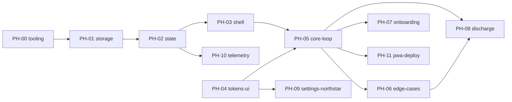

# 컴페이스 — 구현 위상 계획 (Phased Build Plan)

> **역할:** 구현 **순서·의존성·완료 판정**의 SSOT. "무엇을(WHAT)"은 [`SPEC.md`](../SPEC.md), "어떻게 동작하나(HOW-it-runs)"는 [`TECH-SPEC.md`](../TECH-SPEC.md) — 이 문서는 그 내용을 재기술하지 않고 링크만 건다.
> **정본 경계:** 위상 순서·의존성 = 이 문서. 스코프 내용 자체는 `SPEC.md`가 정본 — 충돌 시 `SPEC.md`가 최신.
> **작성 규칙:** 위상 파일은 `docs/phases/PH-xx-*.md` 1개당 1위상. 에이전트는 세션당 `CLAUDE.md` + 해당 `PH-xx` 파일 + 그 파일이 링크한 SSOT 절만 로드한다(컨텍스트 절약).

---

## 0. 전역 규칙 (모든 위상 공통 — 개별 PH 파일에서 반복 서술 금지)

**전역 DO NOT CHANGE** (모든 위상에 항상 적용, 각 PH 파일은 이 위에 "국소 항목"만 추가):

- `/CLAUDE.md` §2 불변 규칙 전체 (One Task·15분 고정·수동 쪼개기·시간기반 완료·침묵 규칙·실패 무처벌·결정 피로 차단·에너지 바 규약)
- [`TECH-SPEC.md §3`](../TECH-SPEC.md#3-저장소-d-26-얇은-저장-모듈-구현) Storage 인터페이스 시그니처
- `DESIGN-TOKENS.md`의 `action` / `evidence.fill` 토큰 (모드 오버라이드 금지)
- [`DECISIONS.md D-26`](../DECISIONS.md#d-26) 플랫폼 결정(계정·백엔드·푸시 없음)

**위상 종료 조건(Runnable State):** 각 `PH-xx` 파일에 명시된 커맨드가 exit 0. 통과 전까지 다음 위상 착수 금지.

**의존 방향:** 각 위상은 **이전에 완료된 위상의 산출물만** 참조한다. 미래 위상을 전제로 코드를 미리 만들지 않는다(YAGNI, `common/coding-style.md`).

**상세 체크리스트 작성 시점:** 착수 직전 위상만 30~50개 하위 항목까지 상세화한다. 먼 미래 위상은 Goal·의존·SSOT 링크·Non-Goals까지만 적어두고, 그 앞 위상이 끝난 뒤 상세화한다(추측성 과설계 방지).

**품질 자동화 2계층(2026-07-06 추가):** ① Rules(`CLAUDE.md`·`common/coding-style.md` 등)는 항상 컨텍스트에 로드되지만 소프트 가이드(모델이 읽고 따름)다. ② 실제 기계적 강제는 [PH-00](PH-00-tooling.md)이 심는 Hooks(포맷·린트·타입체크·800줄 가드·빌드 검증)가 담당 — PH-00 완료 전까지는 컨벤션 유지가 지시에 의존한다. **PH-00을 최우선 착수 대상으로 둔 이유가 이것.**

**리뷰 자동화:** 각 위상 Runnable State 통과 직후, 사용자 요청 없이 `code-reviewer` 에이전트를 적용한다(`common/code-review.md` "코드 작성/수정 후" 상시 트리거 — 매번 명시적으로 시키지 않아도 됨).

---

## 1. 위상 목록 & 의존성

| ID                                   | 이름                                            | 의존                          | 상태                                      |
| ------------------------------------ | ----------------------------------------------- | ----------------------------- | ----------------------------------------- |
| [PH-00](PH-00-tooling.md)            | 프로젝트 스캐폴딩 & 품질 자동화 훅              | 없음                          | **완료**(Runnable State 통과, 2026-07-06) |
| [PH-01](PH-01-storage.md)            | 데이터 모델 & 저장소                            | PH-00                         | **완료**(Runnable State 통과, 2026-07-06) |
| [PH-02](PH-02-state.md)              | 상태관리(Zustand slice)                         | PH-01                         | **완료**(Runnable State 통과, 2026-07-06) |
| [PH-03](PH-03-shell.md)              | 라우팅 & 앱 셸                                  | PH-02                         | 헤더만 · **착수 대상**                    |
| [PH-04](PH-04-tokens-ui.md)          | 디자인 토큰 파이프라인 & UI 프리미티브          | 없음(PH-03과 독립, 병행 가능) | 헤더만                                    |
| [PH-05](PH-05-core-loop.md)          | 핵심 루프 화면 (대시보드·쪼개기·예측·집중·회고) | PH-02, PH-03, PH-04           | 헤더만 · **우선순위 상향**                |
| [PH-06](PH-06-edge-cases.md)         | 엣지케이스(이탈·일시정지·미완료 이월)           | PH-05                         | 헤더만                                    |
| [PH-07](PH-07-onboarding.md)         | 온보딩 플로우                                   | PH-05                         | 헤더만 · **우선순위 하향(재정렬)**        |
| [PH-08](PH-08-discharge.md)          | 방전 모드                                       | PH-05, PH-06                  | 헤더만                                    |
| [PH-09](PH-09-settings-northstar.md) | 설정 & 북극성                                   | PH-04                         | 헤더만                                    |
| [PH-10](PH-10-telemetry.md)          | 내부 지표 로깅                                  | PH-02                         | 헤더만                                    |
| [PH-11](PH-11-pwa-deploy.md)         | PWA 마무리 & 배포                               | PH-05 이상                    | 헤더만                                    |

---

## 2. 순서 변경 근거 (재정렬 로그)

- **결정 (2026-07-06):** 핵심 루프(PH-05)를 온보딩(PH-07)보다 먼저 작업한다. 이유: 핵심 루프가 제품의 실제 가치 검증 지점이고, 온보딩은 핵심 루프 화면(대시보드·쪼개기)을 **재사용하는 래퍼**이므로 먼저 만들어야 온보딩이 재사용할 대상이 존재한다.
- **의존성 역전 처리:** PH-05는 아직 온보딩이 없는 상태에서 대시보드에 도달해야 한다. 따라서 PH-05는 실제 온보딩 대신 **테스트 픽스처로 과제 1개를 Storage에 시드**하여 대시보드 진입점을 임시로 연다(PH-05 Positive Non-Goals에 명시, 온보딩 UI는 만들지 않는다).
- **PH-07(온보딩)에 허용된 유일한 변경:** 앱 진입 라우트를 "임시 시드 진입"에서 "실제 온보딩 플로우"로 교체하는 것. PH-05가 만든 화면 컴포넌트(대시보드·쪼개기·예측·집중·회고)의 **내부 로직·props 시그니처는 DO NOT CHANGE** — 온보딩은 그것들을 호출만 한다.

---

## Changelog

- **v0.1** — 최초 작성. PH-01~11 정의. 사용자 결정으로 핵심 루프(PH-05) 선순위, 온보딩(PH-07) 후순위 재정렬 반영.
- **v0.2** — PH-00(툴링·품질 자동화 훅) 신설 및 최우선 착수 대상으로 삽입, PH-01 의존 갱신.
- **v0.3** — PH-02(상태관리) Runnable State 통과, 완료로 갱신. PH-03을 다음 착수 대상으로 표시.
