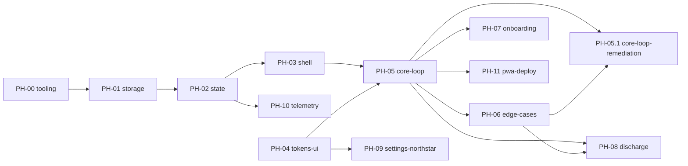

# 컴페이스 — 구현 위상 계획 (Phased Build Plan)

> **역할:** 구현 **순서·의존성·완료 판정**의 SSOT. "무엇을(WHAT)"은 [`SPEC.md`](../SPEC.md), "어떻게 동작하나(HOW-it-runs)"는 [`TECH-SPEC.md`](../TECH-SPEC.md) — 이 문서는 그 내용을 재기술하지 않고 링크만 건다.
> **정본 경계:** 위상 순서·의존성 = 이 문서. 스코프 내용 자체는 `SPEC.md`가 정본 — 충돌 시 `SPEC.md`가 최신.
> **작성 규칙:** 위상 파일은 `docs/phases/PH-xx-*.md` 1개당 1위상. 에이전트는 세션당 `CLAUDE.md` + 해당 `PH-xx` 파일 + 그 파일이 링크한 SSOT 절만 로드한다(컨텍스트 절약).

---

## 0. 전역 규칙 (모든 위상 공통 — 개별 PH 파일에서 반복 서술 금지)

**전역 DO NOT CHANGE** (모든 위상에 항상 적용, 각 PH 파일은 이 위에 "국소 항목"만 추가):

- `/CLAUDE.md` §2 불변 규칙 전체 (One Task·15분 고정·수동 쪼개기·시간기반 완료·침묵 규칙·실패 무처벌·결정 피로 차단·에너지 바 규약)
- [`TECH-SPEC.md §3`](../TECH-SPEC.md#3-저장소-d-26-얇은-저장-모듈-구현) Storage 인터페이스 시그니처
- `DESIGN-TOKENS.md`의 `action` / `evidence.fill` 토큰 (모드 오버라이드 금지)
- [`DECISIONS.md D-26`](../DECISIONS.md#d-26) 플랫폼 결정(계정·백엔드·푸시 없음)

**위상 종료 조건(Runnable State):** 각 `PH-xx` 파일에 명시된 커맨드가 exit 0. 통과 전까지 다음 위상 착수 금지.

**의존 방향:** 각 위상은 **이전에 완료된 위상의 산출물만** 참조한다. 미래 위상을 전제로 코드를 미리 만들지 않는다(YAGNI, `common/coding-style.md`).

**상세 체크리스트 작성 시점:** 착수 직전 위상만 30~50개 하위 항목까지 상세화한다. 먼 미래 위상은 Goal·의존·SSOT 링크·Non-Goals까지만 적어두고, 그 앞 위상이 끝난 뒤 상세화한다(추측성 과설계 방지).

**품질 자동화 2계층(2026-07-06 추가):** ① Rules(`CLAUDE.md`·`common/coding-style.md` 등)는 항상 컨텍스트에 로드되지만 소프트 가이드(모델이 읽고 따름)다. ② 실제 기계적 강제는 [PH-00](PH-00-tooling.md)이 심는 Hooks(포맷·린트·타입체크·800줄 가드·빌드 검증)가 담당 — PH-00 완료 전까지는 컨벤션 유지가 지시에 의존한다. **PH-00을 최우선 착수 대상으로 둔 이유가 이것.**

**리뷰 자동화:** 각 위상 Runnable State 통과 직후, 사용자 요청 없이 `code-reviewer` 에이전트를 적용한다(`common/code-review.md` "코드 작성/수정 후" 상시 트리거 — 매번 명시적으로 시키지 않아도 됨).

**SPEC 커버리지 게이트(2026-07-08 추가 — PH-05 "만만한 1개 자기선택" 누락 사고 이후):** 코드 리뷰·수용 기준 자동화는 **존재하는 코드의 결함**만 잡는다. **SPEC.md에 있는데 아무 코드로도 구현되지 않은 문장**은 둘 다 통과시킨다(테스트가 이미 "빠진 채로" 짜여 있으면 커버리지도 100%로 나온다). 이걸 막는 절차:

1. **착수 직전 상세화 시:** 위상이 인용한 SSOT 절(`SPEC.md §n`)을 문장/화살표 단위로 전부 나열하고, 각 항목을 (a) In-Scope 체크리스트 항목, (b) 착수 전 설계 결정(의도적 단순화·범위 절단), (c) Positive Non-Goals(다음 위상 이관) **셋 중 정확히 하나**에 배정한다. 세 곳 중 어디에도 없는 문장이 하나라도 남으면 상세화가 끝난 게 아니다.
2. **완료 선언 직전:** 위 매핑 표를 다시 훑어 실제 구현이 매핑과 일치하는지 확인한다(구현하다 보니 조용히 생략하고 어디에도 기록 안 한 경우를 잡는 마지막 체크포인트).
3. **이미 "완료"로 마킹된 위상도 예외 아님** — 후속 위상 착수 전 또는 관련 버그 리포트 발생 시, 해당 위상이 인용한 SSOT 절을 다시 훑어 매핑 누락이 있는지 재감사한다(회고성 감사). 발견되면 그 위상 파일의 "구현 중 발견" 항목에 기록하고 별도 수정 위상/태스크로 처리한다 — 조용히 다음 위상으로 넘어가지 않는다.

### 0-1. UI 정량 수용 기준 (화면·컴포넌트 렌더하는 모든 위상 공통 — PH-03·04·05·06·07·08·09 상속)

> **원칙:** UI 수용 기준은 **Playwright·Vitest·axe-core가 기계 검증할 수 있는 픽셀·대비·상태 어서션**으로만 쓴다. "깔끔하다·자연스럽다·잘 보인다" 같은 **사람 판단 문구 금지.** 아래 베이스라인은 여기 한 번만 정의하고 **개별 PH 파일은 이 위상 고유 수치만** 추가한다(반복 서술 금지, §0 위와 동일 규약).
> **하네스:** PH-00이 심은 Playwright(320/768/1024/1440 프로젝트) + Vitest(커버리지 80%) + axe-core. 검증 불가한 기준은 쓰지 않는다.

**① 대비 (WCAG 2.2 AA — §4 톤·침묵 규칙과 충돌 방지 위해 3계층 분리):**

- **상호작용 컨트롤·본문**(버튼·CTA·링크·입력 텍스트·`text.primary`): 일반 ≥ **4.5:1**, 큰 텍스트(≥24px 또는 ≥18.66px bold) ≥ **3:1**. axe-core `color-contrast` 위반 **0건**.
- **상태 지각에 필요한 비텍스트**(에너지 `fill` vs `surface`·포커스 링·입력 테두리·회고 체크 원): ≥ **3:1** (WCAG 1.4.11 Non-text Contrast).
- **의도적 조용 요소**(`text.quiet`·`text.label`·힌트): **4.5:1 면제** — 단 측정 대비값을 수용 기준 표에 *숫자로 기록*하고 의식적으로 수락한다(담백·침묵은 가드레일이지 결함이 아님 · DESIGN-TOKENS §10.3). ⚠️ **"모든 텍스트 4.5:1" 식 일괄 강제 금지** — `text.quiet`(#B5A78E) on `surface.base`(#F6F1E6)는 ~1.7:1이며 이 저대비 조용함은 CLAUDE.md §4·침묵 규칙의 **의도**다. 일괄 강제는 가드레일 위반.

**② 반응형 레이아웃 무결 (320px 기준 깨짐 0):**

- 320·360·390·768px 폭에서 **가로 스크롤 없음**: `document.documentElement.scrollWidth <= clientWidth + 1`(1px 반올림 허용).
- 뷰포트 밖으로 넘치는 요소 **0개**: 대상 전부 `getBoundingClientRect().right <= innerWidth + 1`.
- 터치 타깃 **≥ 44×44 CSS px**(마찰 최소화 §4 — K의 저배터리·둔한 조작 전제. WCAG 2.5.8 최소 24를 상회하는 제품 기준).
- **One Task 어서션:** 대시보드 주 과제 카드 DOM 카운트 **=== 1**(불변 규칙 §2 기계 검증).

**③ 모션 (DB-04 · DESIGN-TOKENS §2-8):**

- `prefers-reduced-motion: reduce`에서 에너지 점등의 computed `transition-duration` **=== `0s`**, 실행 중 keyframe 애니메이션 **0개**(즉시 상태변화 대체).
- 기본 점등 computed `transition-duration` **=== `260ms`**(`duration.cell`), `transition-timing-function` === `cubic-bezier(0.16, 1, 0.3, 1)`(`easing.quiet`).

**④ "상태 코드" — 로컬 우선 PWA 재해석 (D-26: 백엔드·계정·푸시 없음 → HTTP 코드 없음. 아래 어서션으로 대체):**

- **라우트 가드:** 활성 과제 없이 집중 라우트 진입 → 대시보드로 리다이렉트(`await expect(page).toHaveURL(/dashboard/)`).
- **SW/오프라인**(PH-11): 오프라인 리로드가 캐시에서 문서 **200 서빙**, `manifest.webmanifest` 200·유효 파싱.
- **Storage 경계:** 저장 실패(quota 초과 등)가 타입드 결과로 처리되고, UI 폴백이 침묵 규칙을 깨지 않음(부정 문구·에러 토스트 렌더 0).

**⑤ 시각 회귀:**

- 핵심 화면 Playwright 스크린샷(320/390/768) 기준선 대비 `maxDiffPixelRatio ≤ 0.001` 통과.

**⑥ 가드레일 = 어서션 (선언적 강제 — 문서 규칙을 테스트로 못박음):**

- `danger|error|warning|fail` 클래스·토큰 사용 **0건**(§2 처벌색 없음 · DESIGN-TOKENS §5-2).
- 에너지 칸 fill의 computed color가 **완료/미완료/방전 스냅샷에서 동일**(`evidence.fill` 단일성 · §5-1).
- 실패·미완료·부재 상태에 부정 문구/표식 렌더 **0건**(침묵 규칙 · §2).

---

## 1. 위상 목록 & 의존성

| ID                                          | 이름                                            | 의존                          | 상태                                                                                                                                     |
| ------------------------------------------- | ----------------------------------------------- | ----------------------------- | ---------------------------------------------------------------------------------------------------------------------------------------- |
| [PH-00](PH-00-tooling.md)                   | 프로젝트 스캐폴딩 & 품질 자동화 훅              | 없음                          | **완료**(Runnable State 통과, 2026-07-06)                                                                                                |
| [PH-01](PH-01-storage.md)                   | 데이터 모델 & 저장소                            | PH-00                         | **완료**(Runnable State 통과, 2026-07-06)                                                                                                |
| [PH-02](PH-02-state.md)                     | 상태관리(Zustand slice)                         | PH-01                         | **완료**(Runnable State 통과, 2026-07-06)                                                                                                |
| [PH-03](PH-03-shell.md)                     | 라우팅 & 앱 셸                                  | PH-02                         | **완료**(Runnable State 통과, 2026-07-07)                                                                                                |
| [PH-04](PH-04-tokens-ui.md)                 | 디자인 토큰 파이프라인 & UI 프리미티브          | 없음(PH-03과 독립, 병행 가능) | **완료**(Runnable State 통과, 2026-07-07)                                                                                                |
| [PH-05](PH-05-core-loop.md)                 | 핵심 루프 화면 (대시보드·쪼개기·예측·집중·회고) | PH-02, PH-03, PH-04           | **완료**(Runnable State 통과, 2026-07-07) — ⚠️ SPEC 커버리지 갭 2건 발견(2026-07-08), 수정은 [PH-05.1](PH-05.1-core-loop-remediation.md) |
| [PH-05.1](PH-05.1-core-loop-remediation.md) | 핵심 루프 보강 (자기선택 · 영점조절)            | PH-05, PH-06                  | **완료**(Runnable State 통과, 2026-07-08)                                                                                                |
| [PH-06](PH-06-edge-cases.md)                | 엣지케이스(이탈·일시정지·미완료 이월)           | PH-05                         | **완료**(Runnable State 통과, 2026-07-07)                                                                                                |
| [PH-07](PH-07-onboarding.md)                | 온보딩 플로우                                   | PH-05                         | **완료**(Runnable State 통과, 2026-07-08)                                                                                                |
| [PH-08](PH-08-discharge.md)                 | 방전 모드                                       | PH-05, PH-06                  | 헤더만                                                                                                                                   |
| [PH-09](PH-09-settings-northstar.md)        | 설정 & 북극성                                   | PH-04                         | 헤더만                                                                                                                                   |
| [PH-10](PH-10-telemetry.md)                 | 내부 지표 로깅                                  | PH-02                         | 헤더만                                                                                                                                   |
| [PH-11](PH-11-pwa-deploy.md)                | PWA 마무리 & 배포                               | PH-05 이상                    | 헤더만                                                                                                                                   |

---

## 2. 순서 변경 근거 (재정렬 로그)

- **결정 (2026-07-06):** 핵심 루프(PH-05)를 온보딩(PH-07)보다 먼저 작업한다. 이유: 핵심 루프가 제품의 실제 가치 검증 지점이고, 온보딩은 핵심 루프 화면(대시보드·쪼개기)을 **재사용하는 래퍼**이므로 먼저 만들어야 온보딩이 재사용할 대상이 존재한다.
- **의존성 역전 처리:** PH-05는 아직 온보딩이 없는 상태에서 대시보드에 도달해야 한다. 따라서 PH-05는 실제 온보딩 대신 **테스트 픽스처로 과제 1개를 Storage에 시드**하여 대시보드 진입점을 임시로 연다(PH-05 Positive Non-Goals에 명시, 온보딩 UI는 만들지 않는다).
- **PH-07(온보딩)에 허용된 유일한 변경:** 앱 진입 라우트를 "임시 시드 진입"에서 "실제 온보딩 플로우"로 교체하는 것. PH-05가 만든 화면 컴포넌트(대시보드·쪼개기·예측·집중·회고)의 **내부 로직·props 시그니처는 DO NOT CHANGE** — 온보딩은 그것들을 호출만 한다.

---

## Changelog

- **v0.1** — 최초 작성. PH-01~11 정의. 사용자 결정으로 핵심 루프(PH-05) 선순위, 온보딩(PH-07) 후순위 재정렬 반영.
- **v0.2** — PH-00(툴링·품질 자동화 훅) 신설 및 최우선 착수 대상으로 삽입, PH-01 의존 갱신.
- **v0.3** — PH-02(상태관리) Runnable State 통과, 완료로 갱신. PH-03을 다음 착수 대상으로 표시.
- **v0.4** — PH-03(라우팅 & 앱 셸) Runnable State 통과, 완료로 갱신.
- **v0.5** — §0-1 "UI 정량 수용 기준" 신설. UI 위상 공통으로 대비(WCAG 2.2 AA 3계층)·320px 레이아웃 무결·터치 타깃·모션·PWA 상태 어서션·시각 회귀·가드레일 어서션을 기계 검증 수치로 못박음(개별 PH는 고유 수치만 추가). 대비 기준은 §4 침묵 규칙과 충돌하지 않도록 조용 요소를 면제·기록 계층으로 분리.
- **v0.6** — PH-04(디자인 토큰 파이프라인 & UI 프리미티브) Runnable State 통과, 완료로 갱신. 착수 전 WCAG 실측으로 `DESIGN-TOKENS.md` CTA 텍스트 대비 수정(2.31→4.72:1) 및 `evidence.fill` 비텍스트 대비 미달 발견·기록(§10-4, 해결 보류 — 브랜드 상징색이라 임의 변경 안 함).
- **v0.7** — PH-05(핵심 루프 화면) Runnable State 통과, 완료로 갱신. 대시보드·쪼개기·예측·집중·회고 5개 화면 + 신규 슬라이스/셀렉터로 온보딩 없이도 전체 루프가 실제로 동작. 다음 착수 대상은 PH-06(엣지케이스)·PH-07(온보딩) 중 사용자 결정 대기.
- **v0.8** — PH-06(엣지케이스) Runnable State 통과, 완료로 갱신. 타임스탬프 기반 이탈 재계산·명시적 일시정지(길게 누름)/재개·딴생각 포착 모달·세션 복구(재기동 생존)·미완료 블록의 다음날 이월(침묵)까지 SPEC §6 표 그대로 구현. 다음 착수 대상은 PH-07(온보딩)·PH-08(방전 모드) 중 사용자 결정 대기.
- **v0.9** — PH-07(온보딩) 착수 대상으로 확정, 계획만 상세화(구현 아직 없음). 근거: 온보딩은 "임시 시드 진입"을 "실제 앱 진입 경로"로 바꾸는 유일한 위상이라 PH-08(방전, 이미 동작하는 루프의 확장)보다 제품 완결성에 더 근본적. 상세화 중 "1-A 아무거나 입력"이 이미 PH-05/06이 만든 `DashboardPage` zero-task 분기로 충족되어 있음을 확인 — 이번 위상의 신규 작업은 면죄부 3화면 + 최초실행 라우팅 게이트로 범위가 좁혀짐(PH-07 파일 v0.2 참조).
- **v1.0** — PH-07(온보딩) Runnable State 통과, 완료로 갱신. `onboarding-status.ts`(localStorage 플래그) + `OnboardingPage`(면죄부 3화면, 신규 창작 카피) + `DashboardPage` 1줄 게이트로 "임시 시드 진입"이 실제 온보딩 경로로 교체됨. 기존 테스트 2건의 대시보드 직행 전제 갱신 포함 전체 210개 테스트 통과, 320/375px Playwright 왕복 확인 완료. 다음 착수 대상은 PH-08(방전 모드)·PH-09(북극성 v1.3) 중 사용자 결정 대기.
- **v1.1** — **SPEC 커버리지 게이트 신설(사고 대응).** PH-07 세션 중 사용자가 실사용으로 "쪼개기 후 자기선택이 없다"를 발견 → PH-05(이미 "완료")를 SPEC §3·D-05/D-11과 재대조한 결과 2건 갭 확인("만만한 1개 자기선택" 없음·"영점조절 체감 3버튼" 없음, 상세는 PH-05 파일 v0.7). 원인: code-reviewer(존재하는 코드의 결함만 봄)·수용 기준 자동화(존재하는 테스트의 통과 여부만 봄) 둘 다 "SPEC에 있는데 아무 코드로도 구현 안 된 문장"을 잡는 용도가 아니었음. **재발 방지:** 본 §0에 SPEC 커버리지 게이트(착수 직전 SSOT 문장 전수 배정 + 완료 직전 재확인, 이미 완료된 위상도 후속 위상 착수 전 소급 재감사 대상) 추가, `_TEMPLATE.md`에 SPEC 커버리지 표 신설. PH-05의 두 갭은 별도 위상/태스크로 수정 예정(사용자 결정 대기), PH-05 완료 상태는 유지.
- **v1.2** — 사용자 결정: PH-05의 갭 2건을 **[PH-05.1(핵심 루프 보강)](PH-05.1-core-loop-remediation.md)** 위상으로 분리하고 계획만 상세화(구현 아직 없음). 의존은 PH-05·PH-06(RetroPage의 딴생각 포착·세션 복구 등 기존 산출물 국소 확장이라). 자기선택은 새 화면이 아니라 대시보드의 기존 "쪼개짐+큐有" 분기를 확장(선택=큐 재정렬 `promoteQueuedBlock`, 큐 1개면 회귀 없이 자동 노출 그대로)해 PredictPage/FocusPage는 무변경으로 유지. 영점조절 3버튼은 `retro-context-slice`에 `capturedThought`와 동일 패턴(인메모리, 언마운트 시 정리)으로 추가, 텔레메트리 영속은 이번 위상 범위 밖(PH-10).
- **v1.3** — PH-05.1(핵심 루프 보강) Runnable State 통과, 완료로 갱신. `selectQueuedBlocksForTask`·`promoteQueuedBlock`으로 자기선택을 큐 재정렬로 구현, `DashboardPage`에 `FragmentChoice`(큐 2개 이상일 때만, 1개면 회귀 없이 기존 자동 진행) 추가. `retro-context-slice`에 `timeSenseFeedback`/`setTimeSenseFeedback` 추가하고 `RetroPage`에 3버튼(완료·미완료 공통 렌더, 응답 비강제) 삽입. PH-05의 기존 core-loop 통합 테스트를 큐 2개 시나리오에 맞게 갱신(자동 CTA 클릭 → 옵션 탭 클릭). 전체 231개 테스트 통과(커버리지 97.6%), typecheck/lint/build 전부 exit 0, Playwright mobile-320 실제 클릭 왕복(자기선택 경로·1개 자동 진행 회귀 경로)으로 가로 스크롤 0 확인.
