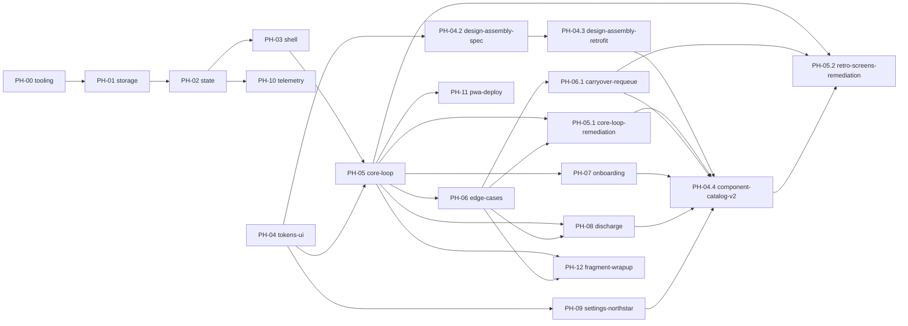

# 컴페이스 — 구현 위상 계획 (Phased Build Plan)

> **역할:** 구현 **순서·의존성·완료 판정**의 SSOT. "무엇을(WHAT)"은 [`SPEC.md`](../SPEC.md), "어떻게 동작하나(HOW-it-runs)"는 [`TECH-SPEC.md`](../TECH-SPEC.md) — 이 문서는 그 내용을 재기술하지 않고 링크만 건다.
> **정본 경계:** 위상 순서·의존성 = 이 문서. 스코프 내용 자체는 `SPEC.md`가 정본 — 충돌 시 `SPEC.md`가 최신.
> **작성 규칙:** 위상 파일은 `docs/phases/PH-xx-*.md` 1개당 1위상. 에이전트는 세션당 `CLAUDE.md` + 해당 `PH-xx` 파일 + 그 파일이 링크한 SSOT 절만 로드한다(컨텍스트 절약).

---

## 0. 전역 규칙 (모든 위상 공통 — 개별 PH 파일에서 반복 서술 금지)

**전역 DO NOT CHANGE** (모든 위상에 항상 적용, 각 PH 파일은 이 위에 "국소 항목"만 추가):

- `/CLAUDE.md` §2 불변 규칙 전체 (One Task·15분 고정·수동 쪼개기·시간기반 완료·침묵 규칙·실패 무처벌·결정 피로 차단·에너지 바 규약)
- [`TECH-SPEC.md §3`](../TECH-SPEC.md#3-저장소-d-26-얇은-저장-모듈-구현) Storage 인터페이스 시그니처
- `DESIGN-TOKENS.md`의 `action` / `evidence.fill` 토큰 (모드 오버라이드 금지)
- [`DECISIONS.md D-26`](../DECISIONS.md#d-26) 플랫폼 결정(계정·백엔드·푸시 없음)

**위상 종료 조건(Runnable State):** 각 `PH-xx` 파일에 명시된 커맨드가 exit 0. 통과 전까지 다음 위상 착수 금지.

**의존 방향:** 각 위상은 **이전에 완료된 위상의 산출물만** 참조한다. 미래 위상을 전제로 코드를 미리 만들지 않는다(YAGNI, `common/coding-style.md`).

**상세 체크리스트 작성 시점:** 착수 직전 위상만 30~50개 하위 항목까지 상세화한다. 먼 미래 위상은 Goal·의존·SSOT 링크·Non-Goals까지만 적어두고, 그 앞 위상이 끝난 뒤 상세화한다(추측성 과설계 방지).

**품질 자동화 2계층(2026-07-06 추가):** ① Rules(`CLAUDE.md`·`common/coding-style.md` 등)는 항상 컨텍스트에 로드되지만 소프트 가이드(모델이 읽고 따름)다. ② 실제 기계적 강제는 [PH-00](PH-00-tooling.md)이 심는 Hooks(포맷·린트·타입체크·800줄 가드·빌드 검증)가 담당 — PH-00 완료 전까지는 컨벤션 유지가 지시에 의존한다. **PH-00을 최우선 착수 대상으로 둔 이유가 이것.**

**리뷰 자동화:** 각 위상 Runnable State 통과 직후, 사용자 요청 없이 `code-reviewer` 에이전트를 적용한다(`common/code-review.md` "코드 작성/수정 후" 상시 트리거 — 매번 명시적으로 시키지 않아도 됨).

**컴포넌트 카탈로그 게이트(`PH-04.4` 신설 — 2026-07-11):** `DESIGN-SYSTEM.md`는 참고 문헌이 아니라 **UI를 렌더하는 모든 위상의 착수 선행 조건**이다. PH-05~09가 각자 페이지 CSS로 회고 인정칩·보너스 카드·타이머 디스플레이·텍스트 입력·북극성 배지를 그때그때 재발명하고 어느 것도 `DESIGN-SYSTEM.md`에 등재되지 않은 채로 "완료" 처리된 사고(`PH-04.4` 감사로 발견) 이후 신설.

1. **착수 직전:** 이 위상이 필요로 하는 UI 패턴을 `DESIGN-SYSTEM.md §5 컴포넌트 카탈로그`와 대조한다. 카탈로그에 없으면 **먼저 §5·§6에 항목을 추가**(anatomy·states·토큰 바인딩·CLAUDE.md §6 가드레일 근거)하고, 그 다음에야 `src/components`에 코드를 짠다 — 카탈로그 없이 페이지 로컬 CSS로 새 패턴을 만드는 것은 이 시점부터 금지.
2. **완료 선언 직전:** 이 위상이 실제로 만든 컴포넌트가 카탈로그 문서와 일치하는지 재확인(SPEC 커버리지 게이트 2단계와 동일 리듬).
3. **중복 발견 시:** 같은 UI 패턴(예: 텍스트 입력)이 이미 2곳 이상에서 로컬 구현으로 존재하면, 신규 위상이 세 번째 재발명을 하지 않고 즉시 공용 컴포넌트로 승격한다(DRY, `common/coding-style.md`).

**SPEC 커버리지 게이트(2026-07-08 추가 — PH-05 "만만한 1개 자기선택" 누락 사고 이후):** 코드 리뷰·수용 기준 자동화는 **존재하는 코드의 결함**만 잡는다. **SPEC.md에 있는데 아무 코드로도 구현되지 않은 문장**은 둘 다 통과시킨다(테스트가 이미 "빠진 채로" 짜여 있으면 커버리지도 100%로 나온다). 이걸 막는 절차:

1. **착수 직전 상세화 시:** 위상이 인용한 SSOT 절(`SPEC.md §n`)의 문장/화살표 **그리고 `SCREEN-FLOW.md §3` 상태전이 행(현재상태 × 이벤트 → 다음상태)**을 전부 나열하고, 각 항목을 (a) In-Scope 체크리스트 항목, (b) 착수 전 설계 결정(의도적 단순화·범위 절단), (c) Positive Non-Goals(다음 위상 이관) **셋 중 정확히 하나**에 배정한다. 세 곳 중 어디에도 없는 문장/전이가 하나라도 남으면 상세화가 끝난 게 아니다. **⚠️ SPEC 산문만 대조하면 상태기계 전이(타이머 3상태·회고 4조합·블록 수명주기·백그라운드 타임스탬프 재계산 등)를 놓친다 — 2026-07-08 PH-05/06 소급 감사가 이걸 실증했다(SPEC 산문엔 옅고 SCREEN-FLOW §3-1·SPEC §6에만 뚜렷한 "미완료 조각 다음날 그대로 이월"의 반쪽 구현이 그렇게 샜다). SSOT = SPEC 문장 ∪ SCREEN-FLOW 전이.**
2. **완료 선언 직전:** 위 매핑 표를 다시 훑어 실제 구현이 매핑과 일치하는지 확인한다(구현하다 보니 조용히 생략하고 어디에도 기록 안 한 경우를 잡는 마지막 체크포인트).
3. **이미 "완료"로 마킹된 위상도 예외 아님** — 후속 위상 착수 전 또는 관련 버그 리포트 발생 시, 해당 위상이 인용한 SSOT 절을 다시 훑어 매핑 누락이 있는지 재감사한다(회고성 감사). 발견되면 그 위상 파일의 "구현 중 발견" 항목에 기록하고 별도 수정 위상/태스크로 처리한다 — 조용히 다음 위상으로 넘어가지 않는다.

**전이 → 명명 테스트 변환(착수 직전, 위 1단계와 한 몸 — TDD를 상태기계에서 유도):** 나열한 각 SCREEN-FLOW 전이 행·SPEC 문장마다 `이음새 + 명명 테스트`를 1행씩 적고 **RED로 먼저 깐다.** 이음새는 셋 중 하나로 고정한다 — ① **순수 셀렉터/슬라이스**(Vitest, in/out) · ② **라우트·상태 전이**(Playwright, 예: 활성 과제 없이 `/focus` → `/dashboard` 리다이렉트) · ③ **불변식 어서션**(Vitest+axe, 예: One Task 카드 수 === 1 · 에너지 fill 색 완료/미완료 동일 · 부정 문구 === 0). "무엇을 테스트할지"가 막막한 원인은 대개 **잘못된 이음새**를 고른 것이다. 침묵 규칙류 "부재" 요구는 오히려 `count === 0`/`colorA === colorB`로 가장 명확히 검증된다. ⚠️ **§0 북극성("덜 미워하며 잠들었나")은 테스트 대상이 아니다** — K 인터뷰로 앱 밖에서 관측(`CLAUDE.md §0·§9`). 유닛테스트로 뽑으려 하지 않는다(막막함의 일부는 애초에 테스트 불가한 것을 테스트하려는 데서 온다).

**코드 실제 동작 역추출(반자동 대조 도구):** "SPEC에 있는데 코드 없음"의 역방향("코드엔 있는데 SSOT 미기재")까지 잡으려면, **읽기 전용 감사 서브에이전트**(또는 `spec-miner`)로 코드의 실동작을 시나리오로 역추출해 위 매핑 표와 diff한다. 단 그 산출은 **대조용 스크래치이지 커밋 아티팩트가 아니다**(`spec-miner`의 `openspec/` 출력 포맷은 본 프로젝트 정본이 아님 — 참고만). 2026-07-08 소급 감사가 이 방식(읽기 전용 서브에이전트 2개 병렬, 파일 미수정)으로 PH-01~04 클린 확인 + PH-05/06 갭 3건을 검출했다.

**감사 결과 처리:** 갭 0건 위상은 이 절 아래 Changelog에 "소급 감사 통과(날짜) + 관찰"을 1줄로 남긴다. 갭 발견 시 위 3단계대로 해당 PH 파일 "구현 중 발견"에 기록 + 별도 수정 위상/태스크로 분리한다 — 원 위상 "완료"는 되돌리지 않고 원 파일 로직도 재오픈하지 않는다(PH-05 → PH-05.1 선례).

**상위 문서 되먹임 게이트(2026-07-12 추가 — 문서 정합성 감사로 `PH-04.4` 완료가 §1 마스터 상태표에, `PH-05.2`의 6-A 구현이 `DESIGN-SYSTEM.md §6`·`SCREEN-FLOW.md §7`·`DESIGN-BRIEF.md §7`에 되먹임되지 않고 방치된 드리프트 4건을 발견한 이후 신설):** SPEC 커버리지 게이트·컴포넌트 카탈로그 게이트는 "위상이 SSOT를 제대로 구현했는가"를 검증하지만, "위상 완료라는 사실 자체가 그 위상을 참조하는 상위 문서에 반영됐는가"는 별도 절차가 없었다. 위상 파일 내부 수용 기준·Changelog는 [x]/완료로 갱신돼도, 그 파일을 가리키는 **마스터 상태표(§1)**와 **이 위상이 정정·구현한 대상을 서술하는 SSOT 문서**(`SCREEN-FLOW.md`·`DESIGN-SYSTEM.md`·`SPEC.md`·`DESIGN-BRIEF.md` 등의 "미구현"/"다음 단계"/"착수 대기"류 문구)는 별도 세션에서 손대지 않으면 계속 이전 상태로 남는다.

1. **완료 선언 직전(다른 게이트와 동일 시점, 체크리스트 병렬 추가):** 이 위상을 참조하거나 이 위상이 상태를 바꾸는 상위 문서를 전부 나열하고, 각 문서의 상태 문구가 실제 완료 사실과 일치하는지 확인한다. 최소 확인 대상: (a) `phases/README.md §1` 마스터 상태표 이 위상의 행, (b) 이 위상 헤더의 `SSOT:` 링크가 가리키는 문서 중 이 위상의 대상을 "미구현"/"대기"/"다음 단계"로 서술하는 문구.
2. **위상이 여러 세션·여러 Phase에 걸쳐 나뉘어 완료될 때 특히 취약:** 마지막 Phase가 끝난 세션에서 1번을 수행해야 하는데, 중간에 "계획만"으로 등록해둔 §1 행이 실제 완료 후에도 여러 커밋을 거치도록 미갱신 상태로 방치되기 쉽다(`PH-04.4`가 이 패턴의 실제 사례). 위상 파일 자체의 수용 기준·Changelog가 전부 완료로 찍혀 있는데 §1 표만 그대로면 즉시 정정 대상.
3. **후속 위상 착수 전에도 예외 아님** — SPEC 커버리지 게이트 3단계(소급 재감사)와 동일 리듬으로, 새 위상 착수 전 그 위상이 의존하는 이전 위상들의 §1 상태 행이 실제 완료 사실과 일치하는지 훑는다.

드리프트 발견 시 처리는 위 "감사 결과 처리"와 동일하되, 코드 diff 없이 문서만 정정하는 경우이므로 해당 문서 Changelog에 **"문서 정합성 감사 반영(코드 diff 없음)"**으로 표기한다(2026-07-12 문서 감사 세션이 이 표기 관례를 확립).

### 0-1. UI 정량 수용 기준 (화면·컴포넌트 렌더하는 모든 위상 공통 — PH-03·04·05·06·07·08·09 상속)

> **원칙:** UI 수용 기준은 **Playwright·Vitest·axe-core가 기계 검증할 수 있는 픽셀·대비·상태 어서션**으로만 쓴다. "깔끔하다·자연스럽다·잘 보인다" 같은 **사람 판단 문구 금지.** 아래 베이스라인은 여기 한 번만 정의하고 **개별 PH 파일은 이 위상 고유 수치만** 추가한다(반복 서술 금지, §0 위와 동일 규약).
> **하네스:** PH-00이 심은 Playwright(320/768/1024/1440 프로젝트) + Vitest(커버리지 80%) + axe-core. 검증 불가한 기준은 쓰지 않는다.

**① 대비 (WCAG 2.2 AA — §4 톤·침묵 규칙과 충돌 방지 위해 3계층 분리):**

- **상호작용 컨트롤·본문**(버튼·CTA·링크·입력 텍스트·`text.primary`): 일반 ≥ **4.5:1**, 큰 텍스트(≥24px 또는 ≥18.66px bold) ≥ **3:1**. axe-core `color-contrast` 위반 **0건**.
- **상태 지각에 필요한 비텍스트**(에너지 `fill` vs `surface`·포커스 링·입력 테두리·회고 체크 원): ≥ **3:1** (WCAG 1.4.11 Non-text Contrast).
- **의도적 조용 요소**(`text.quiet`·`text.label`·힌트): **4.5:1 면제** — 단 측정 대비값을 수용 기준 표에 *숫자로 기록*하고 의식적으로 수락한다(담백·침묵은 가드레일이지 결함이 아님 · DESIGN-TOKENS §10.3). ⚠️ **"모든 텍스트 4.5:1" 식 일괄 강제 금지** — `text.quiet`(#B5A78E) on `surface.base`(#F6F1E6)는 ~1.7:1이며 이 저대비 조용함은 CLAUDE.md §4·침묵 규칙의 **의도**다. 일괄 강제는 가드레일 위반.

**② 반응형 레이아웃 무결 (320px 기준 깨짐 0):**

- 320·360·390·768px 폭에서 **가로 스크롤 없음**: `document.documentElement.scrollWidth <= clientWidth + 1`(1px 반올림 허용).
- 뷰포트 밖으로 넘치는 요소 **0개**: 대상 전부 `getBoundingClientRect().right <= innerWidth + 1`.
- 터치 타깃 **≥ 44×44 CSS px**(마찰 최소화 §4 — K의 저배터리·둔한 조작 전제. WCAG 2.5.8 최소 24를 상회하는 제품 기준).
- **One Task 어서션:** 대시보드 주 과제 카드 DOM 카운트 **=== 1**(불변 규칙 §2 기계 검증).

**③ 모션 (DB-04 · DESIGN-TOKENS §2-8):**

- `prefers-reduced-motion: reduce`에서 에너지 점등의 computed `transition-duration` **=== `0s`**, 실행 중 keyframe 애니메이션 **0개**(즉시 상태변화 대체).
- 기본 점등 computed `transition-duration` **=== `260ms`**(`duration.cell`), `transition-timing-function` === `cubic-bezier(0.16, 1, 0.3, 1)`(`easing.quiet`).

**④ "상태 코드" — 로컬 우선 PWA 재해석 (D-26: 백엔드·계정·푸시 없음 → HTTP 코드 없음. 아래 어서션으로 대체):**

- **라우트 가드:** 활성 과제 없이 집중 라우트 진입 → 대시보드로 리다이렉트(`await expect(page).toHaveURL(/dashboard/)`).
- **SW/오프라인**(PH-11): 오프라인 리로드가 캐시에서 문서 **200 서빙**, `manifest.webmanifest` 200·유효 파싱.
- **Storage 경계:** 저장 실패(quota 초과 등)가 타입드 결과로 처리되고, UI 폴백이 침묵 규칙을 깨지 않음(부정 문구·에러 토스트 렌더 0).

**⑤ 시각 회귀:**

- 핵심 화면 Playwright 스크린샷(320/390/768) 기준선 대비 `maxDiffPixelRatio ≤ 0.001` 통과.

**⑥ 가드레일 = 어서션 (선언적 강제 — 문서 규칙을 테스트로 못박음):**

- `danger|error|warning|fail` 클래스·토큰 사용 **0건**(§2 처벌색 없음 · DESIGN-TOKENS §5-2).
- 에너지 칸 fill의 computed color가 **완료/미완료/방전 스냅샷에서 동일**(`evidence.fill` 단일성 · §5-1).
- 실패·미완료·부재 상태에 부정 문구/표식 렌더 **0건**(침묵 규칙 · §2).

### 0-2. 위상 등급 (코어 위상 vs 국소 patch 위상, 위상 템플릿 리팩토링 — 2026-07-12 신설)

> PH-09가 "OptionRow/Button 재사용, 재측정 불요"로 이미 암묵 판단했던 것과, `PH-05.2`가 6-A(휴식) 신규 화면에서 `DischargeEntryPage`와 동일 조립 패턴만 재사용한 것(카탈로그 신규 등재 불요, D5)을 규칙화한다. 목적은 §0-1 전체 게이트를 매 위상 기계적으로 반복시키지 않되, 무엇을 생략했는지 항상 명시적으로 남기는 것 — 조용한 생략은 여전히 금지.

**코어 위상** — 다음 중 하나라도 해당하면 코어다: 신규 화면 도입, 신규 컴포넌트 패턴 도입(`DESIGN-SYSTEM.md §5` 신규 등재 필요), 기존 컴포넌트의 토큰 값·CSS 변경. §0-1 전체(①대비 ②레이아웃 ③모션 ④상태 ⑤시각회귀 ⑥가드레일)를 실측한다.

**국소 patch 위상** — 아래 두 조건을 **모두** 만족해야 patch로 분류할 수 있다:

1. 신규 화면이 있어도 카탈로그에 이미 등재된 컴포넌트 조합만 재사용한다(신규 등재 없음).
2. 기존 컴포넌트의 토큰 값·CSS를 변경하지 않는다.

patch 위상이 생략할 수 있는 게이트: **①대비 실측**(재사용 컴포넌트는 이미 실측되어 있음)·**⑤시각 회귀 신규 기준선**(기존 스크린샷과 조립만 다름, 새 기준선 촬영 불요). **생략 불가(patch도 항상 실측):** ②레이아웃 무결·터치 타깃(새 페이지는 새 배치이므로 항상 재확인)·③모션(해당 시)·④상태 어서션·⑥가드레일 어서션(항상 기계 검증) — 이 넷은 재사용 컴포넌트라도 새 조립에서 깨질 수 있어 생략 대상이 아니다.

patch로 분류하는 위상은 PH 파일 헤더(SSOT 링크 아래)에 "**위상 등급:** patch(사유: …)" 1줄을 명시한다. 코어 위상은 등급을 별도 표기하지 않는다(기본값).

---

## 1. 위상 목록 & 의존성

| ID                                              | 이름                                                                        | 의존                                           | 상태                                                                                                                                                          |
| ----------------------------------------------- | --------------------------------------------------------------------------- | ---------------------------------------------- | ------------------------------------------------------------------------------------------------------------------------------------------------------------- |
| [PH-00](PH-00-tooling.md)                       | 프로젝트 스캐폴딩 & 품질 자동화 훅                                          | 없음                                           | **완료**(Runnable State 통과, 2026-07-06)                                                                                                                     |
| [PH-01](PH-01-storage.md)                       | 데이터 모델 & 저장소                                                        | PH-00                                          | **완료**(Runnable State 통과, 2026-07-06)                                                                                                                     |
| [PH-02](PH-02-state.md)                         | 상태관리(Zustand slice)                                                     | PH-01                                          | **완료**(Runnable State 통과, 2026-07-06)                                                                                                                     |
| [PH-03](PH-03-shell.md)                         | 라우팅 & 앱 셸                                                              | PH-02                                          | **완료**(Runnable State 통과, 2026-07-07)                                                                                                                     |
| [PH-04](PH-04-tokens-ui.md)                     | 디자인 토큰 파이프라인 & UI 프리미티브                                      | 없음(PH-03과 독립, 병행 가능)                  | **완료**(Runnable State 통과, 2026-07-07)                                                                                                                     |
| [PH-04.2](PH-04.2-design-assembly-spec.md)      | 디자인 조립 규약 (HIG 원리 선택적 차용)                                     | PH-04                                          | **완료**(Runnable State 통과, 2026-07-11)                                                                                                                     |
| [PH-04.3](PH-04.3-design-assembly-retrofit.md)  | 디자인 조립 규약 소급 적용 (컴포넌트·페이지 리팩터링 + lint 자동화)         | PH-04.2                                        | **완료**(Runnable State 통과, 2026-07-11)                                                                                                                     |
| [PH-05](PH-05-core-loop.md)                     | 핵심 루프 화면 (대시보드·쪼개기·예측·집중·회고)                             | PH-02, PH-03, PH-04                            | **완료**(Runnable State 통과, 2026-07-07) — ⚠️ SPEC 커버리지 갭 2건 발견(2026-07-08), 수정은 [PH-05.1](PH-05.1-core-loop-remediation.md)                      |
| [PH-05.1](PH-05.1-core-loop-remediation.md)     | 핵심 루프 보강 (자기선택 · 영점조절)                                        | PH-05, PH-06                                   | **완료**(Runnable State 통과, 2026-07-08)                                                                                                                     |
| [PH-06](PH-06-edge-cases.md)                    | 엣지케이스(이탈·일시정지·미완료 이월)                                       | PH-05                                          | **완료**(Runnable State 통과, 2026-07-07) — ⚠️ SPEC/SCREEN-FLOW 커버리지 갭 1건(MED, 2026-07-08), 세션 내 절반 수정은 [PH-06.1](PH-06.1-carryover-requeue.md) |
| [PH-06.1](PH-06.1-carryover-requeue.md)         | 세션 내 이월 보강 (중단 조각 큐 복귀)                                       | PH-05, PH-06                                   | **완료**(Runnable State 통과, 2026-07-10)                                                                                                                     |
| [PH-07](PH-07-onboarding.md)                    | 온보딩 플로우                                                               | PH-05                                          | **완료**(Runnable State 통과, 2026-07-08)                                                                                                                     |
| [PH-08](PH-08-discharge.md)                     | 방전 모드                                                                   | PH-05, PH-06 (PH-06.1 후 권장)                 | **완료**(Runnable State 통과, 2026-07-10)                                                                                                                     |
| [PH-09](PH-09-settings-northstar.md)            | 설정 & 북극성                                                               | PH-04                                          | **완료**(Runnable State 통과, 2026-07-10)                                                                                                                     |
| [PH-04.4](PH-04.4-component-catalog.md)         | 컴포넌트 카탈로그 v2 (SCREEN-FLOW 전체 커버리지)                            | PH-04.3, PH-05.1, PH-06.1, PH-07, PH-08, PH-09 | **완료**(Runnable State 통과, 2026-07-11)                                                                                                                     |
| [PH-05.2](PH-05.2-retro-screens-remediation.md) | 회고 화면 잔여 정합 (2z/3-A 문서 정정 · 6-A 신설 · 회고 미노출 리포트 확인) | PH-05, PH-06.1, PH-04.4                        | **완료**(Runnable State 통과, 2026-07-12)                                                                                                                     |
| [PH-10](PH-10-telemetry.md)                     | 내부 지표 로깅                                                              | PH-02                                          | **완료**(Runnable State 통과, 2026-07-13)                                                                                                                     |
| [PH-11](PH-11-pwa-deploy.md)                    | PWA 마무리 & 배포                                                           | PH-05 이상                                     | **완료**(Runnable State 통과, 2026-07-13)                                                                                                                     |
| [PH-12](PH-12-fragment-wrapup.md)               | 조각 마무리 선택 (5-C, 자연 종료 시 완료/이어가기 사용자 결정)              | PH-05, PH-06                                   | 계획 완료(상세화, 2026-07-14) — 구현 착수 대기                                                                                                                |

---

## 2. 순서 변경 근거 (재정렬 로그)

- **결정 (2026-07-06):** 핵심 루프(PH-05)를 온보딩(PH-07)보다 먼저 작업한다. 이유: 핵심 루프가 제품의 실제 가치 검증 지점이고, 온보딩은 핵심 루프 화면(대시보드·쪼개기)을 **재사용하는 래퍼**이므로 먼저 만들어야 온보딩이 재사용할 대상이 존재한다.
- **의존성 역전 처리:** PH-05는 아직 온보딩이 없는 상태에서 대시보드에 도달해야 한다. 따라서 PH-05는 실제 온보딩 대신 **테스트 픽스처로 과제 1개를 Storage에 시드**하여 대시보드 진입점을 임시로 연다(PH-05 Positive Non-Goals에 명시, 온보딩 UI는 만들지 않는다).
- **PH-07(온보딩)에 허용된 유일한 변경:** 앱 진입 라우트를 "임시 시드 진입"에서 "실제 온보딩 플로우"로 교체하는 것. PH-05가 만든 화면 컴포넌트(대시보드·쪼개기·예측·집중·회고)의 **내부 로직·props 시그니처는 DO NOT CHANGE** — 온보딩은 그것들을 호출만 한다.

---

## Changelog

- **v3.0(2026-07-14)** — **`PH-12`(조각 마무리 선택) 등록, 계획만.** PH-11 이후 실사용 감사로 `SCREEN-FLOW.md` P14/P15/P16 신설(자연 종료 시 완료 판정 주체가 시스템 자동에서 사용자 선택으로 바뀌어야 함) — 이걸 코드로 옮기는 첫 위상. SSOT 대조 표·설계 결정 6개(에너지 점등-완료판정 분리, 방전 블록 우회, 5-C `WrapUpOverlay` 조립, 기존 900초 자동완료 테스트 교체 등) 확정, 위상 등급 patch. P15(이탈 안내 문구)·P16(딴생각 포착 용도 확장)은 범위 밖으로 분리(향후 별도 patch). 의존: PH-05·PH-06. 구현은 다음 세션.

- **v0.1** — 최초 작성. PH-01~11 정의. 사용자 결정으로 핵심 루프(PH-05) 선순위, 온보딩(PH-07) 후순위 재정렬 반영.
- **v0.2** — PH-00(툴링·품질 자동화 훅) 신설 및 최우선 착수 대상으로 삽입, PH-01 의존 갱신.
- **v0.3** — PH-02(상태관리) Runnable State 통과, 완료로 갱신. PH-03을 다음 착수 대상으로 표시.
- **v0.4** — PH-03(라우팅 & 앱 셸) Runnable State 통과, 완료로 갱신.
- **v0.5** — §0-1 "UI 정량 수용 기준" 신설. UI 위상 공통으로 대비(WCAG 2.2 AA 3계층)·320px 레이아웃 무결·터치 타깃·모션·PWA 상태 어서션·시각 회귀·가드레일 어서션을 기계 검증 수치로 못박음(개별 PH는 고유 수치만 추가). 대비 기준은 §4 침묵 규칙과 충돌하지 않도록 조용 요소를 면제·기록 계층으로 분리.
- **v0.6** — PH-04(디자인 토큰 파이프라인 & UI 프리미티브) Runnable State 통과, 완료로 갱신. 착수 전 WCAG 실측으로 `DESIGN-TOKENS.md` CTA 텍스트 대비 수정(2.31→4.72:1) 및 `evidence.fill` 비텍스트 대비 미달 발견·기록(§10-4, 해결 보류 — 브랜드 상징색이라 임의 변경 안 함).
- **v0.7** — PH-05(핵심 루프 화면) Runnable State 통과, 완료로 갱신. 대시보드·쪼개기·예측·집중·회고 5개 화면 + 신규 슬라이스/셀렉터로 온보딩 없이도 전체 루프가 실제로 동작. 다음 착수 대상은 PH-06(엣지케이스)·PH-07(온보딩) 중 사용자 결정 대기.
- **v0.8** — PH-06(엣지케이스) Runnable State 통과, 완료로 갱신. 타임스탬프 기반 이탈 재계산·명시적 일시정지(길게 누름)/재개·딴생각 포착 모달·세션 복구(재기동 생존)·미완료 블록의 다음날 이월(침묵)까지 SPEC §6 표 그대로 구현. 다음 착수 대상은 PH-07(온보딩)·PH-08(방전 모드) 중 사용자 결정 대기.
- **v0.9** — PH-07(온보딩) 착수 대상으로 확정, 계획만 상세화(구현 아직 없음). 근거: 온보딩은 "임시 시드 진입"을 "실제 앱 진입 경로"로 바꾸는 유일한 위상이라 PH-08(방전, 이미 동작하는 루프의 확장)보다 제품 완결성에 더 근본적. 상세화 중 "1-A 아무거나 입력"이 이미 PH-05/06이 만든 `DashboardPage` zero-task 분기로 충족되어 있음을 확인 — 이번 위상의 신규 작업은 면죄부 3화면 + 최초실행 라우팅 게이트로 범위가 좁혀짐(PH-07 파일 v0.2 참조).
- **v1.0** — PH-07(온보딩) Runnable State 통과, 완료로 갱신. `onboarding-status.ts`(localStorage 플래그) + `OnboardingPage`(면죄부 3화면, 신규 창작 카피) + `DashboardPage` 1줄 게이트로 "임시 시드 진입"이 실제 온보딩 경로로 교체됨. 기존 테스트 2건의 대시보드 직행 전제 갱신 포함 전체 210개 테스트 통과, 320/375px Playwright 왕복 확인 완료. 다음 착수 대상은 PH-08(방전 모드)·PH-09(북극성 v1.3) 중 사용자 결정 대기.
- **v1.1** — **SPEC 커버리지 게이트 신설(사고 대응).** PH-07 세션 중 사용자가 실사용으로 "쪼개기 후 자기선택이 없다"를 발견 → PH-05(이미 "완료")를 SPEC §3·D-05/D-11과 재대조한 결과 2건 갭 확인("만만한 1개 자기선택" 없음·"영점조절 체감 3버튼" 없음, 상세는 PH-05 파일 v0.7). 원인: code-reviewer(존재하는 코드의 결함만 봄)·수용 기준 자동화(존재하는 테스트의 통과 여부만 봄) 둘 다 "SPEC에 있는데 아무 코드로도 구현 안 된 문장"을 잡는 용도가 아니었음. **재발 방지:** 본 §0에 SPEC 커버리지 게이트(착수 직전 SSOT 문장 전수 배정 + 완료 직전 재확인, 이미 완료된 위상도 후속 위상 착수 전 소급 재감사 대상) 추가, `_TEMPLATE.md`에 SPEC 커버리지 표 신설. PH-05의 두 갭은 별도 위상/태스크로 수정 예정(사용자 결정 대기), PH-05 완료 상태는 유지.
- **v1.2** — 사용자 결정: PH-05의 갭 2건을 **[PH-05.1(핵심 루프 보강)](PH-05.1-core-loop-remediation.md)** 위상으로 분리하고 계획만 상세화(구현 아직 없음). 의존은 PH-05·PH-06(RetroPage의 딴생각 포착·세션 복구 등 기존 산출물 국소 확장이라). 자기선택은 새 화면이 아니라 대시보드의 기존 "쪼개짐+큐有" 분기를 확장(선택=큐 재정렬 `promoteQueuedBlock`, 큐 1개면 회귀 없이 자동 노출 그대로)해 PredictPage/FocusPage는 무변경으로 유지. 영점조절 3버튼은 `retro-context-slice`에 `capturedThought`와 동일 패턴(인메모리, 언마운트 시 정리)으로 추가, 텔레메트리 영속은 이번 위상 범위 밖(PH-10).
- **v1.3** — PH-05.1(핵심 루프 보강) Runnable State 통과, 완료로 갱신. `selectQueuedBlocksForTask`·`promoteQueuedBlock`으로 자기선택을 큐 재정렬로 구현, `DashboardPage`에 `FragmentChoice`(큐 2개 이상일 때만, 1개면 회귀 없이 기존 자동 진행) 추가. `retro-context-slice`에 `timeSenseFeedback`/`setTimeSenseFeedback` 추가하고 `RetroPage`에 3버튼(완료·미완료 공통 렌더, 응답 비강제) 삽입. PH-05의 기존 core-loop 통합 테스트를 큐 2개 시나리오에 맞게 갱신(자동 CTA 클릭 → 옵션 탭 클릭). 전체 231개 테스트 통과(커버리지 97.6%), typecheck/lint/build 전부 exit 0, Playwright mobile-320 실제 클릭 왕복(자기선택 경로·1개 자동 진행 회귀 경로)으로 가로 스크롤 0 확인.
- **v1.4** — **SPEC 커버리지 게이트 방법론 확장 + 전 위상 소급 감사 스윕(2026-07-08).** ① §0 게이트 1단계에 **SCREEN-FLOW §3 상태전이 행 대조**를 추가(SSOT = SPEC 문장 ∪ SCREEN-FLOW 전이). SPEC 산문만 대조하면 상태기계 전이를 놓친다는 것을 소급 감사가 실증. ② **전이 → 명명 테스트 변환** 절차(3 이음새: 셀렉터/라우트/불변식, RED 먼저) + **코드 실동작 역추출**(읽기 전용 감사 서브에이전트·spec-miner, 산출은 스크래치) + **감사 결과 처리 규칙**을 §0에 명문화. ③ 게이트 신설(v1.1) 이전 완료된 위상 소급 감사: **PH-01~04 클린 통과**(갭 0·삼켜진 에러 0·후속 위상 DO NOT CHANGE 위반 0. 핵심 불변식 전부 PASS — Storage 4메서드 시그니처·evidence.fill 단일·action/evidence 모드 비재정의·danger계열 0·box-sizing 리셋·primitive 비노출. LOW 관찰 1: `blocks.taskId` 인덱스 현재 미사용 dead index, 위반 아님). **PH-05/06 감사: CRITICAL/HIGH 0, 갭 3건**(상세는 각 PH 파일 "구현 중 발견") — [MED] 미완료 조각 "다음날 그대로 이월"(SPEC §6·SCREEN-FLOW P4) 반쪽 구현(큐 인메모리 + 인세션 "오늘은 여기까지" 조각 재큐잉 없음 → 조각 소멸) · [LOW] "과제 재편집" 진입점 부재(SCREEN-FLOW §2 실선) · [LOW-reverse] `DevSkipButton`(DEV 가드, 수용). PH-05.1 두 수정(자기선택·영점조절)은 present 재확인. **MED 이월 갭의 수정 위상 분리·순서는 사용자 결정 대기.**
- **v1.5** — PH-06.1(세션 내 이월 보강) Runnable State 통과, 완료로 갱신. v1.4 소급 감사가 발견한 MED 갭("다음날 그대로 이월"의 세션 내 절반)을 해소 — `RetroPage`의 "오늘은 여기까지" 경로에서만 기존 `queueBlocks`를 재사용해 중단 조각을 같은 과제 큐 후미로 재큐잉(신규 액션 불필요, `Block.verbLabel`이 이미 PH-05 `startBlock`에서 채워짐을 확인해 회고 컨텍스트 별도 캡처도 불필요). "이어서 15분 더"·완료 경로는 무변경. 명명 테스트 5개 전부 구현(단위 + 실제 라우트 트리 통합 1건). 전체 238개 테스트 통과(커버리지 97.5%stmt), typecheck/lint/build 전부 exit 0. 재부팅·익일 큐 부활(Storage 영속)은 범위 밖으로 유지(post-MVP).
- **v1.6** — PH-08(방전 모드) Runnable State 통과, 완료로 갱신. 신규 `discharge-slice`(세션 범위 `dischargeMode`/`dischargeEndMessage`)로 `DischargeEntryPage`·`DischargeDashboardPage`를 플레이스홀더에서 실구현으로 교체하고, `useFocusTimer`에 회고 전체 스킵 분기(`finishDischargePath`)를 추가 — 진짜 과제·큐는 보존(`dequeue` 없음), 에너지는 시작 즉시 점등, 종료는 자체 창작 한 줄과 함께 대시보드 직행. `DashboardPage`에 상시 노출 저마찰 링크(실행 가능한 조각이 있을 때만)와 방전 종료 배너를 추가. 전체 260개 테스트 통과(커버리지 97.76% stmt), typecheck/lint/build 전부 exit 0, 임시 Playwright 스펙(비커밋)으로 320/375px 왕복 및 `/predict`·`/retro` 미경유 실증. 다음 착수 대상은 PH-09(설정 & 북극성)·PH-10(내부 지표 로깅) 중 사용자 결정 대기.
- **v1.7** — PH-09(설정 & 북극성) 착수 직전 상세화(계획만, 구현 없음). SSOT 발췌·SPEC 커버리지 표·전이-명명 테스트·설계 결정 6개(로컬스토리지 유틸로 저장, Zustand 슬라이스/Storage 확장 없음 · 양가 목표는 optional 문자열 2개 · 북극성 편집 화면 1개를 대시보드/설정이 공유 · 대시보드 설정 진입점 신규 · 알림은 opt-in 값 저장까지만 · 배지는 순수 정적 텍스트) 확정. 다음 착수 대상은 PH-09 구현·PH-10(내부 지표 로깅) 중 사용자 결정 대기.
- **v1.8** — PH-09(설정 & 북극성) Runnable State 통과, 완료로 갱신. `north-star-storage.ts`/`north-star-selectors.ts`/`notification-pref.ts`(onboarding-status.ts 패턴 계승, 신규 Zustand 슬라이스·Storage 확장 없음) + `NorthStarPage`(신규 라우트 `/north-star`, 대시보드·설정 공유 진입점) + `DashboardPage`에 북극성 배지/초대 링크 + 상시 설정 링크 + `SettingsPage` 전면 재작성(플레이스홀더 졸업). 기존 `router.test.tsx`의 "still-placeholder" 스위트가 SettingsPage 구플레이스홀더 텍스트를 어서션하고 있어 PH-09 실제 콘텐츠 검증으로 교체(회귀 아님). code-reviewer 백그라운드 리뷰가 MEDIUM 2건 발견 → 즉시 반영: `DashboardPage`가 50줄 lint 제한을 넘겨 신규 경고가 생겼던 것을 `handleAddTask` 팩토리 추출(RetroPage `makeThoughtActions`와 동일 패턴)로 46줄까지 원복(경고 6건, PH-09 이전 기준선 동일) · "도달률/진행 수치 렌더 0건" 명명 테스트가 체크리스트엔 완료 표기됐지만 실제 가드 테스트가 빠져 있어 3개 화면에 추가. 전체 306개 테스트 통과(커버리지 97.82%stmt), typecheck/lint(경고 6건, 에러 0)/build 전부 exit 0, 임시 Playwright 스크립트(비커밋)로 320/375px 대시보드→설정→북극성 편집→저장→대시보드 왕복 실증(가로 스크롤 0, 44×44px 이상). 다음 착수 대상은 PH-10(내부 지표 로깅)·PH-11(PWA 마무리) 중 사용자 결정 대기.
- **v1.9(2026-07-11)** — **디자인 조립 계층 신설.** 사용자가 "화면흐름도+토큰 조합만으로는 조립 시 디자인 맥락이 부족하다"를 지적, `DESIGN-TOKENS.md §10-6`이 예고해둔 "컴포넌트 토큰(다음 단계)"를 Apple HIG 원리의 선택적 차용으로 채우기로 결정. **[PH-04.1](PH-04-tokens-ui.md) 대신 `X.2`부터 시작한 이유:** 이미 PH-04 파일 내부 changelog가 "v0.1~v0.7"을 자체 버전으로 쓰고 있어 위상 ID `PH-04.1`을 새로 만들면 그 changelog 버전과 혼동 소지 — 기존 `PH-05.1`/`PH-06.1` 넘버링이 원 위상 이름의 changelog와 독립적인 신규 파일이었던 것과 달리 PH-04는 이미 `.1`을 연상시키는 소버전 이력이 있어 `.2`부터 배정. **PH-04.2/PH-04.3 분리 근거:** (a) 문서·ADR·파일럿 검증(PH-04.2)과 (b) 이미 완성된 6개 컴포넌트·9개 페이지 소급 리팩터링+lint 자동화(PH-04.3)는 리스크 프로파일이 달라 하나로 묶으면 `phases/README.md §0` "착수 직전 위상만 상세화" 원칙과 충돌(범위 미정인 (b)까지 지금 상세화하면 추측성 과설계) — PH-05→PH-05.1, PH-06→PH-06.1 선례와 동일하게 "먼저 상세화·착수" + "헤더만 예고" 2단 분리 적용. **핵심 경계(PH-04.2 파일 D-27 예정 항목):** HIG의 원리(Clarity/Deference/Depth·여백 리듬·타이포 위계·깊이 서열·모션 절제)만 차용하고 SF Pro/SF Symbols/시스템 블루/iOS 네비게이션·탭바 크롬/제스처는 명시적으로 거부 — K의 실기기가 Android(`D-26`)이고 제품 정체성이 웜페이퍼+테라코타(DB-01/02)라 애플 시각 정체성 이식은 anti-template 정책·브랜드 정체성 정면 위반. 두 위상 모두 계획만 등록, 구현은 아직 없음.
- **v2.0(2026-07-11)** — PH-04.2(디자인 조립 규약) Runnable State 통과, 완료로 갱신. 신규 `docs/DESIGN-SYSTEM.md`(여백 리듬 3계층·타이포 위계 ≤3단계·elevation 6종 서열+컴포넌트 매핑표·모션 일관성 표, 위계 선언 문구 포함) + `DECISIONS.md D-27`(HIG 원리 선택적 차용, 시각 정체성 명시적 거부 — 인덱스·부록A 갱신) + `docs/README.md` 문서 지도/정본 소유표 갱신 + `DESIGN-TOKENS.md §10-6` 항목 6 완료 처리(링크 교체, 값 무변경). `TaskCard` 파일럿 대조 결과 여백·타이포·elevation·모션 4개 절 전부 편차 없음(CSS/TSX 무변경) — `Button`/`Chip`의 기존 미스매치(내부 패딩에 "카드-간" 계층 토큰 사용)는 관찰로 기록, `PH-04.3` 소급 감사로 이관. 프로젝트 최초의 committed Playwright 스펙 `e2e/task-card.spec.ts` 신설(온보딩 1화면이 이미 `TaskCard`를 렌더하는 것을 이용해 별도 시드 없이 320/390/768px 스크린샷·가로 스크롤 0·44×44px 터치 타깃 검증, `vitest.config.ts`에 `e2e/**` 제외 추가해 vitest가 이 스펙을 오수집하던 문제 해소). 전체 306개 vitest 통과, typecheck/lint(경고 6건, 에러 0)/build 전부 exit 0, `npx playwright test --grep TaskCard` 3 passed(단일 프로젝트로 스코프, 4-프로젝트 매트릭스 중복 실행은 `test.skip`으로 방지)/9 skipped, 스크린샷 3장 육안 확인(가로 스크롤 없음, 토큰 그대로 렌더). **Playwright 스냅샷 파일명에 OS가 박혀 있음(`*-win32.png`)** — 현재 CI 워크플로 없어 지금은 문제없으나, 추후 Linux CI 도입 시 베이스라인 재생성 또는 OS-고정 시각회귀 잡 구성 필요(`PH-04.3` 또는 CI 도입 위상에 인계). 다음 착수 대상은 `PH-04.3`(6종 컴포넌트·9개 페이지 소급 감사) 또는 `PH-05`계열 잔여 위상(`PH-10`/`PH-11`) 중 사용자 결정 대기.
- **v2.1(2026-07-11)** — PH-04.3(디자인 조립 규약 소급 적용) Runnable State 통과, 완료로 갱신. PH-04.2가 관찰로만 남겨둔 편차(`Button`/`Chip` 내부 패딩의 카드-간 계층 오배정, `Button.primary`/`Chip.selected`/`OptionRow`의 elevation 매핑 누락)를 SSOT로 승계해 CSS만 수정(토큰 값·TSX 무변경) + 이 세션에서 5개 컴포넌트·9개 페이지를 직접 전수 대조해 추가 편차 4건 발견·수정(`DashboardPage`/`PredictPage`/`RetroPage`의 형제 `OptionRow` 리스트, `SplitPage`의 `draftRow` 리스트 — 전부 카드-간 계층으로 gap 정렬). `stylelint` 신설(`declaration-property-value-disallowed-list`로 간격 raw px·색 raw hex/rgba 기계 차단, `tokens.generated.css` 제외) + `lint:css` 스크립트 + PostToolUse 훅(`lint-on-write.cjs`) 확장으로 `.css` 저장 시에도 자동 `--fix`. `OptionRow` 자체 내부 패딩과 페이지의 버튼 스택 간격은 SSOT(`DESIGN-SYSTEM.md`)가 명시적으로 언급하지 않은 항목이라 이 위상에서 재해석해 변경하지 않기로 결정(SSOT 범위 밖 재해석 금지 원칙 적용). 검증 중 `npm install`이 플로팅 `eslint` 버전을 끌어올리며 이 위상과 무관한 `e2e/task-card.spec.ts`의 Playwright 공식 관용구에서 `no-empty-pattern` 에러가 새로 발생 — Runnable State를 막아 1줄 `eslint-disable`로 해소(범위 밖이지만 게이트 통과에 필요). `Button` 시각 변경으로 커밋된 `e2e/task-card.spec.ts-snapshots/*.png` 픽셀 diff 발생 → 육안 확인(의도된 변경만, 가로 스크롤·레이아웃 밀림 없음) 후 베이스라인 재생성. 전체 306개 vitest 통과, typecheck/lint(경고 6건, 에러 0)/lint:css/build 전부 exit 0, 비커밋 임시 Playwright 스크립트로 온보딩→쪼개기→대시보드(자기선택)→예측 실제 클릭 왕복 확인(320px, 가로 스크롤 0). 다음 착수 대상은 PH-10(내부 지표 로깅)·PH-11(PWA 마무리) 중 사용자 결정 대기.
- **v2.2(2026-07-11)** — **컴포넌트 카탈로그 게이트 신설 + `PH-04.4` 등록(계획만).** PH-04.3이 6종 프리미티브(`Button`·`Chip`·`TaskCard`·`EnergyBar`·`OptionRow`·`BottomSheet`)만 소급 감사했을 뿐, 그 이후 완료된 PH-05.1/06.1/07/08/09가 각자 페이지 CSS로 회고 인정칩(`RecognitionChip`)·보너스 카드(`BonusCard`)·타이머 디스플레이·텍스트 입력(3곳 중복)·북극성 배지를 재발명하면서 어느 것도 `DESIGN-SYSTEM.md`에 등재되지 않았다는 것을 사용자 요청으로 감사해 확인. **재발 방지 2건:** ① 본 §0에 "컴포넌트 카탈로그 게이트"(착수 직전 카탈로그 대조 → 없으면 먼저 등재 → 그 다음 구현, 완료 직전 재확인) 신설 — SPEC 커버리지 게이트와 동일 리듬으로 UI 패턴 재발명을 원천 차단. ② `docs/README.md`에 문서 관계도(mermaid) 신설 — `DESIGN-SYSTEM.md`를 "구현 직전 참고"가 아니라 **PH-xx 착수 게이트**로 격상하고, `src/` 작업 중 발견한 신규 패턴이 카탈로그로 역류 등재되는 흐름을 다이어그램의 점선으로 명시. `PH-04.4`(컴포넌트 카탈로그 v2)를 위 표·mermaid 의존 그래프에 등록(의존: PH-04.3 + 소급 감사 대상 5개 위상, 계획만/착수 대기).
- **v2.3(2026-07-12)** — **`PH-05.2`(회고 화면 잔여 정합) 등록(계획만).** 사용자가 SCREEN-FLOW.md 화면 6·7과 연결된 6-A(휴식) 화면 미구현을 지적 → 원인 소급 진단 결과, PH-05 v0.2(SSOT 발췌 필수화 이전 버전)가 "2z·6-A·3-A는 SSOT 화면 목록에 없다"고 원문 재대조 없이 판단하고 그 판단이 SCREEN-FLOW.md에 되먹임되지 않은 채 이후 문서(PH-04.4·DESIGN-SYSTEM.md)에 그대로 인용되며 굳어진 SSOT 드리프트로 확인(자기선택 D-05·영점조절 D-11에 이은 3번째 동일 유형 재발). 재확인 결과 **2z·3-A는 이미 PH-04.4가 "`AddTaskPrompt` 겸용"으로 해소 판정을 내린 상태**(코드 변경 불요, 문서 정정만 필요)였고, **6-A만 실재하는 갭**으로 확인. 세션 중 사용자가 실제 앱 구동에서 "15분 종료 후 회고 화면(6 계열) 자체가 안 보이고 곧장 다음 화면으로 넘어간다"는 리포트를 추가로 제기 — 코드 정적 분석(`useFocusTimer.ts`/`RetroPage.tsx` 배선)으로는 재현되지 않아 원인 미확인 상태로 남음. 사용자 지시로 이번 세션은 재현·구현에 착수하지 않고 진단·합의 내용만 `PH-05.2` 파일로 기록, 실제 편집·구현은 전부 차기 세션으로 이관. 위상 템플릿 리팩토링(SSOT 대조 표 통합·"부재 주장=검색 로그" 규칙·위상 등급 분리)도 같은 파일에 병행 트랙으로 기록만 하고 미착수.
- **v2.4(2026-07-12)** — PH-05.2(회고 화면 잔여 정합) Runnable State 통과, 완료로 갱신. Playwright로 "회고 화면 미노출" 리포트를 실제 재현 — `/retro`를 전혀 거치지 않고 대시보드로 직행함을 확인. 근본원인 = React 18 StrictMode(dev)가 마운트 직후 effect를 클린업→재실행으로 재시뮬레이션하면서 `RetroPage`의 언마운트 전용 클린업이 `lastResolvedBlock`을 순간적으로 null화 → 가드 오작동. `RetroPage`가 라이브 스토어 구독 대신 마운트 시점 스냅샷(`useState` lazy init)을 가드 근거로 쓰도록 수정, StrictMode 재검증으로 확인. `SCREEN-FLOW.md`(v0.4)·`SPEC.md` §4의 2z/3-A 배지를 `PH-04.4` 해소 판정에 맞춰 정정. **6-A(휴식) 구현**: `ROUTES.rest` 신규 + `RestPage`(`DischargeEntryPage` 조립 패턴 재사용, 카탈로그 신규 등재 불요) + `RetroPage` completed 분기에 "잠시 쉬기" 버튼 추가(미완료 분기 무변경) + `resolveNextRoute`를 `lib/core-loop-selectors.ts`로 추출해 두 페이지 공유(DRY) + `makeRetroActions` 팩토리로 `RetroPage` 본체를 50줄 lint 제한 아래로 유지. 전체 336개 테스트 통과(커버리지 97.73%stmt), typecheck/lint/lint:css/build 전부 exit 0(사전 존재 경고·에러는 stash 대조로 회귀 아님 확인), 비커밋 임시 Playwright 스크립트로 dev 서버 실제 왕복(집중 종료→회고→잠시쉬기→휴식 화면→오늘은 그만→대시보드, 375px 가로 스크롤 0) 확인. `code-reviewer` 백그라운드 리뷰 APPROVE(CRITICAL/HIGH/MEDIUM 0건). 위상 템플릿 리팩토링 병행 트랙은 여전히 별도 착수 대기.
- **v2.5(2026-07-12)** — **위상 템플릿 리팩토링 완료**(`PH-05.2` 병행 트랙 실행, 문서 전용 변경). §0에 **0-2. 위상 등급**(코어 vs 국소 patch) 신설 — patch 위상(카탈로그 신규 등재 없음 + 기존 컴포넌트 무변경)은 대비 실측·시각회귀 신규 기준선을 생략 가능, 레이아웃·모션·상태·가드레일 어서션은 patch도 항상 실측. `_TEMPLATE.md`(v0.5)에서 "SPEC 커버리지 표"·"전이→명명 테스트 표"·(각 PH가 산문으로 따로 적던) "착수 전 설계 결정"을 **SSOT 대조 표** 하나로 통합(배정/이음새/명명테스트/비고 5열) + **"부재 주장 = 검색 로그" 규칙** 신설(Positive Non-Goal·SSOT 부재 배정 행은 비고 열에 실제 검색 결과 또는 `0 matches` 필수). `PH-05.2` 파일에 검증 드라이런 기록 — 근거 없이 "SPEC·DECISIONS에 명세 없음"이라고만 쓴 1차 초안이 신설 규칙에 실제로 걸리는 것을 확인한 뒤 `DECISIONS.md`/`SCREEN-FLOW.md` 실제 Grep 결과로 보강. 코드 diff 없음, Runnable State 재실행 대상 아님.
- **v2.6(2026-07-12)** — **문서 정합성 감사 반영(코드 diff 없음).** §1 표의 `PH-04.4` 상태가 v2.2 이후 실제로는 Phase 4 구현·`code-reviewer` 소급 수정(v0.5, 2026-07-11)까지 끝나 Runnable State를 통과했음에도 "계획만(착수 대기)"으로 방치돼 있던 드리프트를 발견·정정("완료"로 갱신) — `PH-04.4` 파일 자체의 수용 기준·Changelog(v0.4/v0.5)와 `git log`(`5c5698b` "Phase 4 완료")는 이미 완료를 기록하고 있었으나 이 표에 되먹임되지 않았다(이 표가 후속 `PH-05.2` 의존 그래프에 `PH-04.4`를 "전부 완료" 전제로 이미 걸고 있어 논리적으로도 상태 불일치였음). 함께 `DESIGN-SYSTEM.md §6`의 6-A(휴식) 조립 레시피 행이 "미구현"으로 남아 있던 것도 `PH-05.2`(2026-07-12, `RestPage` 구현) 반영해 정정 — 상세는 해당 문서 Changelog.
- **v2.7(2026-07-12)** — **상위 문서 되먹임 게이트 신설(재발 방지, 사용자 확인).** v2.6이 발견한 드리프트 4건(`PH-04.4`/6-A 관련, `SCREEN-FLOW.md`·`DESIGN-BRIEF.md` 포함)이 전부 "위상 파일 자체는 완료를 기록했지만 그 완료가 상위 문서(마스터 상태표·해당 위상이 정정하는 SSOT)에 되먹임되지 않은" 동일 패턴이라는 것을 근거로, §0에 **상위 문서 되먹임 게이트** 신설(완료 선언 직전 §1 행 + 관련 SSOT 문구 확인, 여러 세션에 걸친 위상 특히 취약, 후속 위상 착수 전 소급 확인, 드리프트 발견 시 "문서 정합성 감사 반영(코드 diff 없음)" 표기 관례 명문화). 코드 diff 없음, Runnable State 재실행 대상 아님.
- **v2.8(2026-07-13)** — PH-10(내부 지표 로깅) Runnable State 통과, 완료로 갱신. 착수 직전 SSOT 대조 중 `session-slice.ts`의 `startSession`이 PH-02부터 정의만 있고 실제 블록 시작 경로 어디서도 호출되지 않아 Session 레코드가 한 건도 생성되지 않던 갭을 발견 — `PredictPage`/`RetroPage`(이어서 15분 더)/`DischargeDashboardPage`(방전 진입) 3개 호출부에 배선해 해소. 신규 순수 함수 `src/lib/telemetry-selectors.ts`(`computeDailyTelemetry`)로 시동 성공률·예측 적중률 시계열·방전 진입 빈도를 기존 Storage(`findByDateRange`, 직전 세션에서 이미 도입)만으로 계산 — 신규 스토리지·신규 사용자 입력·프로덕션 호출 경로 전부 없음(SPEC §10 "와이어 영향 0" 확정, Grep으로 이 모듈을 import하는 비테스트 파일 0건 확인). "구현은 post-MVP" 문구는 사용자 확인 하에 "계산 로직·세션 배선은 지금, 노출/대시보드는 계속 post-MVP"로 스코프 분리해 진행. 위상 등급 = patch(신규 화면·컴포넌트 없음, README §0-1 UI 기준 전부 N/A). 전체 354개 테스트 통과, typecheck/lint(경고 11건, 착수 전과 동일)/build 전부 exit 0.
- **v2.9(2026-07-13)** — PH-11(PWA 마무리 & 배포) Runnable State 통과, 완료로 갱신. `vercel.json`(sw.js/workbox/manifest는 no-cache, 해시 자산은 immutable 장기 캐시 — TECH-SPEC §9 "캐시 헤더 조정 정도만" 그대로) + `e2e/pwa-offline.spec.ts`(오프라인 리로드 200, manifest 200+파싱) + `scripts/check-bundle-budget.mjs`(entry JS<300kb/CSS<50kb gzip) + `scripts/check-lighthouse-budget.mjs`(모바일 프리셋 LCP/CLS/FCP/TBT, Playwright 번들 Chromium 재사용) 신설. 착수 중 발견: `DESIGN-TOKENS.md`가 PH-04부터 확정한 `Gowun Batang`/`Gowun Dodum`이 실제로는 한 번도 로딩 배선되지 않아 시스템 폰트로 폴백 중이던 갭을 `@fontsource` 자체 호스팅(한글 서브셋만)으로 해소 — PH-11이 "폰트 로딩" SSOT(`web/performance.md`)를 처음 소유하는 위상이라 이번에 접수. Lighthouse 실측에서 LCP/FCP가 로컬 예산을 초과 — 3단계 진단(무스로틀 250ms 우수 → `injectRegister: 'script-defer'` 적용해도 불변 → devtools 실측도 4.4s + `network-requests` 감사로 전 요청 `http/1.1` 확인)으로 근본 원인이 앱 성능이 아니라 `vite preview`의 HTTP/1.1 커넥션 큐잉(라우트별 다중 청크 × 6-커넥션 상한)임을 확인 — CLS/TBT(프로토콜 무관)만 hard gate 유지, LCP/FCP는 advisory로 다운그레이드하고 Vercel 실배포(HTTP/2) 후 재검증 필요로 기록. 실제 Vercel 프로젝트 연결·배포 실행은 사용자 계정 작업이라 범위 밖(설정 파일만, 실행 절차는 세션 응답으로 사용자에게 안내). 위상 등급 = patch. 부수 발견: `npm run test` 기본 병렬 실행에서 PH-10(미커밋) 세션 로깅 테스트 1건이 간헐적 타이밍 플레이크를 보임(`--no-file-parallelism`로는 354/354 결정적 통과) — PH-11 코드와 무관해 이 위상에서는 기록만 남기고 수정하지 않음, PH-10 커밋 세션에서 별도 확인 필요.
